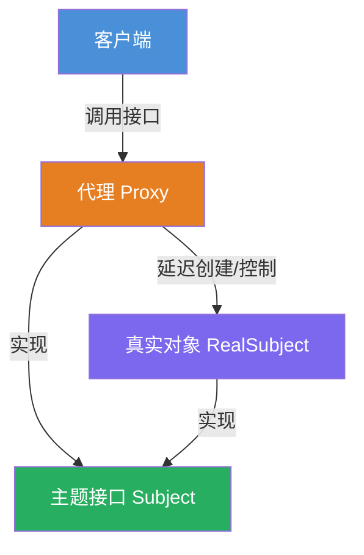
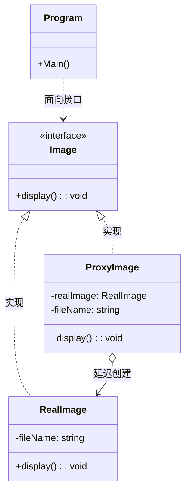

# 代理模式教程

[TOC]


## 一、📖 概述

代理模式是**结构型设计模式**，为真实对象提供一个**代理**，由代理控制对真实对象的访问。

核心思想：代理与真实对象实现相同接口，客户端通过代理间接访问真实对象，代理可在访问前后附加额外逻辑（如延迟加载、访问控制、日志记录等），对客户端完全透明。

### 核心特性

- **透明性**：客户端无需知道代理的存在，通过相同接口调用

- **延迟加载**：虚拟代理可在首次访问时才创建真实对象，节省资源

- **访问控制**：代理可拦截调用，执行权限检查等前置逻辑

- **符合开闭原则**：新增代理类型无需修改真实对象代码

<br/>

## 二、📐 结构图解

### 2.1 整体结构



### 2.2 类关系



<br/>

## 三、💻 代码实现

以虚拟代理延迟加载图片为例：`ProxyImage` 先只记录文件名，仅当第一次调用 `display()` 时才创建 `RealImage` 并加载磁盘，后续调用直接复用。

### 3.1 主题接口

```csharp
// 图片接口，定义公共操作
public interface IImage
{
    void Display();
}
```

### 3.2 真实对象

```csharp
// 真实图片，构造时立即从磁盘加载
public class RealImage : IImage
{
    private string _fileName;

    public RealImage(string fileName)
    {
        _fileName = fileName;
        LoadFromDisk();
    }

    public void Display() => Console.WriteLine($"显示图片: {_fileName}");

    private void LoadFromDisk() => Console.WriteLine($"加载图片: {_fileName}");
}
```

### 3.3 代理对象

```csharp
// 代理图片，延迟加载核心逻辑
public class ProxyImage : IImage
{
    private RealImage _realImage;
    private string _fileName;

    public ProxyImage(string fileName)
    {
        _fileName = fileName;
        // 构造时不创建RealImage，仅记录文件名
    }

    public void Display()
    {
        if (_realImage == null)
        {
            _realImage = new RealImage(_fileName); // 首次访问才创建
        }
        _realImage.Display();
    }
}
```

### 3.4 客户端使用

```csharp
public class Program
{
    public static void Main()
    {
        IImage image = new ProxyImage("photo.jpg");

        // 第一次调用：触发加载
        image.Display();

        // 第二次调用：直接显示，不再加载
        image.Display();
    }
}
```

**运行结果**：
```
加载图片: photo.jpg
显示图片: photo.jpg
显示图片: photo.jpg
```

<br/>

## 四、🔍 核心解析

### 4.1 接口一致性

`ProxyImage` 和 `RealImage` 都实现 `IImage` 接口，客户端面向接口编程，无需区分代理与真实对象。

### 4.2 延迟加载机制

`ProxyImage` 构造时仅保存文件名，`Display()` 中通过 `if (_realImage == null)` 判断是否需要创建真实对象，首次调用后复用已有实例。

### 4.3 客户端无感知

客户端代码只依赖 `IImage` 接口，代理的存在对客户端透明，切换代理实现无需修改客户端逻辑。

<br/>

## 五、🎯 应用场景

### 5.1 适用场景

- 资源加载代价高昂，需要延迟到使用时才初始化

- 需要对远程对象进行本地代理调用

- 需要在访问真实对象前执行权限检查或日志记录

### 5.2 实际案例

- **虚拟代理**：图片编辑器延迟加载大图，避免启动卡顿

- **远程代理**：.NET `MarshalByRefObject` 远程对象代理

- **保护代理**：数据库访问层在执行前检查用户权限

<br/>

## 六、⚖️ 优缺点分析

### 6.1 优点

- **延迟初始化**：减少不必要的资源消耗，提升启动性能

- **访问控制**：代理层可灵活添加权限、日志等横切关注点

- **客户端透明**：无需修改客户端代码即可引入代理逻辑

### 6.2 缺点

- **增加间接层**：调用链变长，可能引入轻微性能开销

- **复杂度增加**：需要维护代理与真实对象的同步逻辑

<br/>

## 七、📝 总结

- **核心思想**：为真实对象提供代理，由代理控制访问，对客户端透明

- **关键角色**：主题接口、真实对象、代理、客户端

- **适用场景**：延迟加载、远程调用、访问控制等需要间接访问的场景

- **注意事项**：代理应保持接口一致性，避免引入额外的耦合
