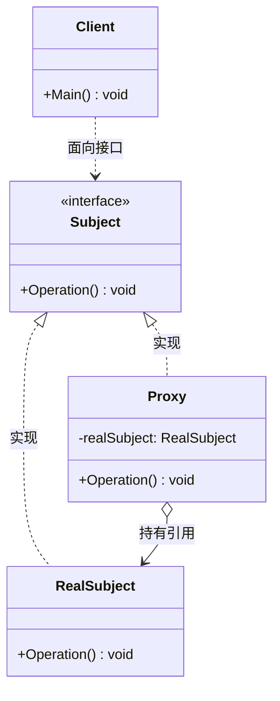
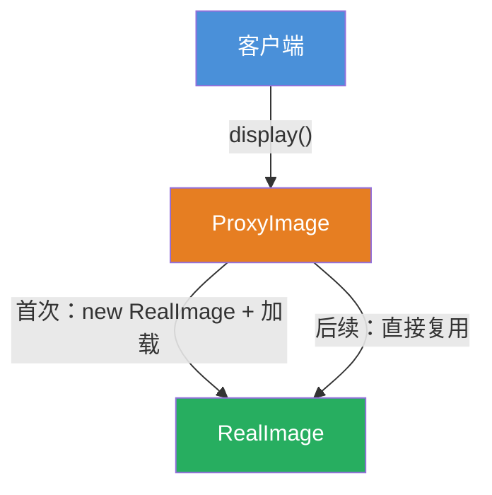
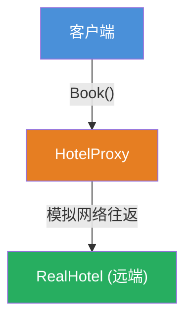
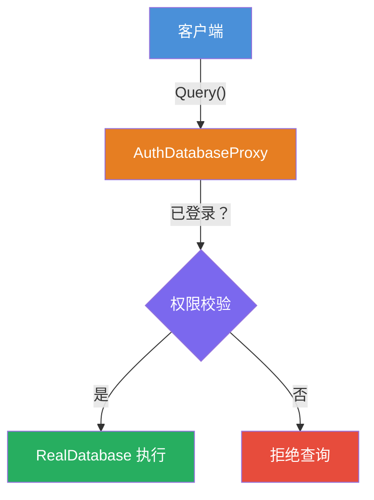

# 代理模式（Proxy Pattern）

[TOC]

## 一、📖 概述

代理模式是**结构型设计模式**，为真实对象提供一个**代理**，由代理控制对真实对象的访问。

核心思想：代理与真实对象实现相同接口，客户端通过代理间接访问真实对象，代理可在访问前后附加额外逻辑（如延迟加载、访问控制、远程调用等），对客户端完全透明。

<br/>

## 二、🧩 模式解析

### 2.1 类关系图



### 2.2 三类代理对比

| 类型 | 目的 | 实现要点 |
| --- | --- | --- |
| **虚拟代理 Virtual** | 延迟创建开销大的对象 | 首次访问时才实例化真实对象，后续复用 |
| **远程代理 Remote** | 为远程对象提供本地代表 | 本地代理封装网络通信细节 |
| **保护代理 Protective** | 控制对真实对象的访问权限 | 调用前检查用户身份或权限 |

> 三种类型的具体示例见第三节。

### 2.3 关键解析

**客户端无感知**：代理与真实对象实现相同接口，客户端只面向接口编程，切换实现无需修改客户端逻辑（开闭原则）。

**与装饰器模式的区别**：

| 对比维度 | 代理模式 Proxy | 装饰器模式 Decorator |
| --- | --- | --- |
| 核心目的 | **控制对象访问**——控制什么时候、是否可以创建/调用真实对象 | **叠加新增功能**——调用前后附加能力 |
| 包装对象 | 通常只包装 1 个对象 | 支持多层嵌套包装 |
| 目标 | 管控访问，不是增强能力 | 增强能力，不是管控访问 |

<br/>

## 三、💻 代码示例

### 3.1 虚拟代理：图片延迟加载

> 场景：`ProxyImage` 构造时只记录文件名，首次 `display()` 才创建 `RealImage` 并从磁盘加载，后续调用直接复用。



| 角色 | 文件 |
| --- | --- |
| 主题接口 | [`VirtualProxy/Image.cs`](VirtualProxy/Image.cs) |
| 真实对象 | [`VirtualProxy/RealImage.cs`](VirtualProxy/RealImage.cs) |
| 代理 | [`VirtualProxy/ProxyImage.cs`](VirtualProxy/ProxyImage.cs) |

### 3.2 远程代理：酒店预订

> 场景：`HotelProxy` 在本地扮演远端酒店，封装模拟网络往返，客户端无需感知调用了远程服务。



| 角色 | 文件 |
| --- | --- |
| 主题接口 | [`RemoteProxy/IHotel.cs`](RemoteProxy/IHotel.cs) |
| 真实对象（远端） | [`RemoteProxy/RealHotel.cs`](RemoteProxy/RealHotel.cs) |
| 代理 | [`RemoteProxy/HotelProxy.cs`](RemoteProxy/HotelProxy.cs) |

### 3.3 保护代理：数据库权限校验

> 场景：`AuthDatabaseProxy` 在执行 `Query` 前校验用户是否已登录，未登录则拒绝。



| 角色 | 文件 |
| --- | --- |
| 主题接口 | [`ProtectiveProxy/IDatabase.cs`](ProtectiveProxy/IDatabase.cs) |
| 真实对象 | [`ProtectiveProxy/RealDatabase.cs`](ProtectiveProxy/RealDatabase.cs) |
| 代理 | [`ProtectiveProxy/AuthDatabaseProxy.cs`](ProtectiveProxy/AuthDatabaseProxy.cs) |
| 客户端 | [`Program.cs`](Program.cs) |

### 3.4 运行结果

```
========== 代理模式 (Proxy Pattern) ==========
为其他对象提供代理以控制对这个对象的访问

--- 虚拟代理 (Virtual Proxy) ---
加载 photo.jpg
显示 photo.jpg

显示 photo.jpg

--- 远程代理 (Remote Proxy) ---
正在联系远程酒店服务器...
预订成功: 海景双人房

--- 保护代理 (Protective Proxy) ---
执行查询: SELECT * FROM users
拒绝查询: 未登录，无权访问数据库
```

<br/>

## 四、📝 小结

- **核心思想**：为真实对象提供代理，由代理控制访问，对客户端透明

- **三类应用**：虚拟代理延迟加载、远程代理封装网络、保护代理校验权限

- **注意事项**：代理应保持与真实对象接口一致，避免引入额外耦合；延迟加载只在首次产生成本