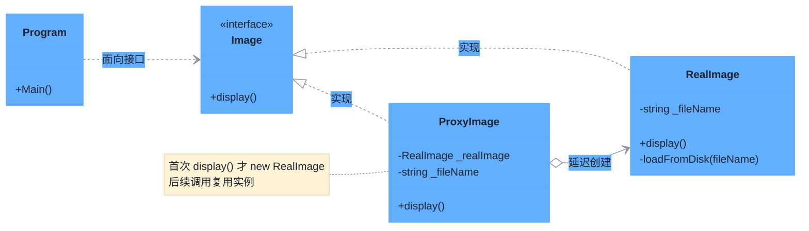

# 代理模式（Proxy Pattern）

> **核心思想**：为真实对象提供一个**代理**，由代理控制对真实对象的访问。代理与真实对象实现**相同接口**，可在访问前后附加额外逻辑（如延迟加载、访问控制、日志等），对客户端透明。

## 解决什么问题

加载一张大图代价高昂，若客户端在启动时就创建 `RealImage` 并立即从磁盘加载，会拖慢启动。代理模式实现**虚拟代理（延迟加载）**：`ProxyImage` 先只记录文件名，仅当第一次调用 `display()` 时才真正创建并加载 `RealImage`，后续调用直接复用，避免重复加载。

## 主要参与者

| 角色 | 本示例类 | 职责 |
| --- | --- | --- |
| 主题 Subject | `Image` | 定义真实对象与代理的公共接口 `display()` |
| 真实主题 RealSubject | `RealImage` | 执行真正的磁盘加载与显示 |
| 代理 Proxy | `ProxyImage` | 持文件名，首次访问时创建真实对象 |
| 客户端 Client | `Program` | 只面向 `Image` 接口编程 |

## 类图



## 源码结构

目录下源码文件与职责对应：

- **Image.cs**：主题接口，含 `display()`。
- **RealImage.cs**：真实对象，构造函数即调用 `loadFromDisk()` 加载磁盘；`display()` 输出显示信息。
- **ProxyImage.cs**：代理核心。`display()` 中 `if (_realImage == null)` 才创建 `RealImage`，实现延迟加载；再次调用直接复用，不再重复加载。
- **Program.cs**：以 `Image` 类型持有 `ProxyImage`，连续两次调用 `display()`——第一次输出 "Loading..."（真正加载），第二次直接显示。

```csharp
// ProxyImage.display() 核心代码
public void display() {
    if (_realImage == null) {
        _realImage = new RealImage(_fileName);   // 仅首次创建+加载
    }
    _realImage.display();
}
```
