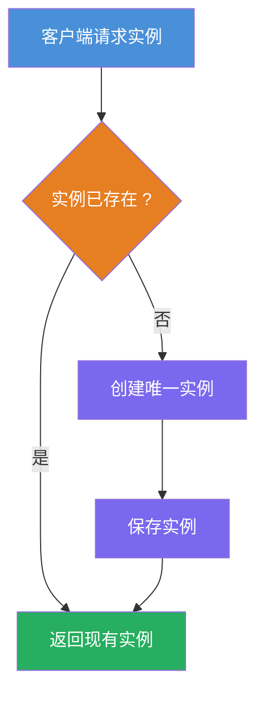
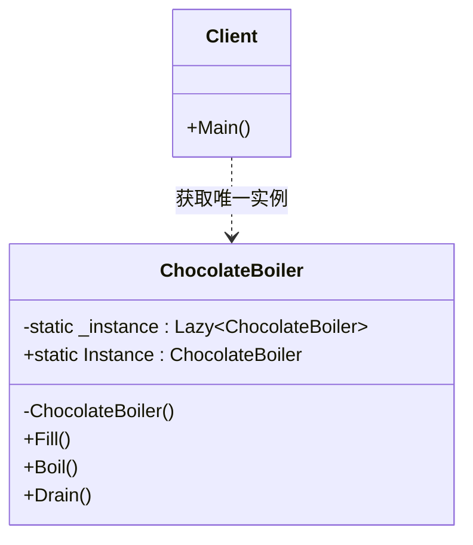

# 单例模式教程

[TOC]


## 一、📖 概述

单例模式是**创建型设计模式**，保证一个类**只有一个实例**并提供**全局访问点**。

核心思想：控制实例化过程，确保整个应用中某个类只存在一个对象，避免资源浪费和状态不一致。

### 核心特性

- **唯一性**：类只能有一个实例，多次获取返回同一对象

- **全局访问**：提供静态属性或方法供外部获取实例

- **延迟初始化**：首次使用时才创建实例，节省资源

- **线程安全**：多线程环境下仍保证只有一个实例

<br/>

## 二、📐 结构图解

### 2.1 获取流程



### 2.2 类关系



<br/>

## 三、💻 代码实现

以巧克力锅炉为例：工厂中只能有一个锅炉实例，多个实例会导致同时加料造成生产混乱。

### 3.1 单例类

```csharp
// 巧克力锅炉 - 单例
public class ChocolateBoiler
{
    // Lazy<T> 保证线程安全的延迟初始化
    private static readonly Lazy<ChocolateBoiler> _instance =
        new(() => new ChocolateBoiler());

    // 全局访问点
    public static ChocolateBoiler Instance => _instance.Value;

    // 私有构造，外部无法实例化
    private ChocolateBoiler() { }

    private bool _isEmpty = true;
    private bool _isBoiled = false;

    public void Fill()
    {
        if (_isEmpty)
        {
            Console.WriteLine("填充牛奶和可可粉...");
            _isEmpty = false;
        }
    }

    public void Boil()
    {
        if (!_isEmpty && !_isBoiled)
        {
            Console.WriteLine("煮沸混合物...");
            _isBoiled = true;
        }
    }

    public void Drain()
    {
        if (!_isEmpty && _isBoiled)
        {
            Console.WriteLine("排出巧克力...");
            _isEmpty = true;
            _isBoiled = false;
        }
    }
}
```

### 3.2 客户端使用

```csharp
ChocolateBoiler boiler1 = ChocolateBoiler.Instance;
ChocolateBoiler boiler2 = ChocolateBoiler.Instance;

boiler1.Fill();   // 填充
boiler2.Boil();   // 同一实例，煮沸

// 验证是同一对象
Console.WriteLine(ReferenceEquals(boiler1, boiler2)); // True
```

**运行结果**：
```
填充牛奶和可可粉...
煮沸混合物...
True
```

<br/>

## 四、🔍 核心解析

### 4.1 私有构造函数

构造函数设为 `private`，阻止外部通过 `new` 创建实例，是单例的基石。

### 4.2 Lazy\<T\> 实现

`Lazy<T>` 由 CLR 保证线程安全，首次访问时才执行构造函数，既避免双重检查锁定的复杂性，又实现延迟加载。

### 4.3 全局访问点

静态属性 `Instance` 封装实例获取逻辑，客户端无需关心创建过程，直接使用即可。

<br/>

## 五、🎯 应用场景

### 5.1 适用场景

- 需要全局唯一的资源管理器（如连接池、配置管理器）

- 需要协调共享资源的访问（如日志记录器、线程池）

- 需要跨模块共享状态的场景

### 5.2 实际案例

- **.NET中的典型单例**：`HttpClientFactory` 管理的共享实例、`IConfiguration` 根配置

- **框架内置**：`ServiceProvider` 在整个应用生命周期内保持单例

- **工业场景**：数据库连接池、线程池、缓存管理器

<br/>

## 六、⚖️ 优缺点分析

### 6.1 优点

- **控制实例数量**：严格保证只有一个实例，避免资源浪费

- **全局访问**：任何位置都能方便地获取实例

- **延迟初始化**：按需创建，减少启动开销

### 6.2 缺点

- **测试困难**：全局状态影响单元测试，难以隔离

- **违反单一职责**：既要管理业务逻辑，又要管理自身生命周期

- **隐藏依赖**：调用方不通过参数获取依赖，代码耦合不易察觉

<br/>

## 七、📝 总结

- **核心思想**：保证一个类只有一个实例并提供全局访问点

- **关键角色**：私有构造函数、静态实例、全局访问属性

- **适用场景**：需要全局唯一实例且需要控制资源访问

- **注意事项**：过度使用会导致状态管理和测试困难，优先考虑依赖注入
