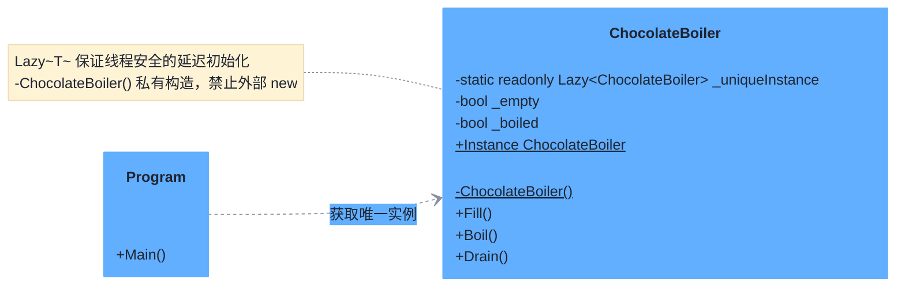

# 单例模式（Singleton Pattern）

> **核心思想**：保证一个类**只有一个实例**，并提供一个**全局访问点**。本示例用 .NET 的 `Lazy<T>` 实现线程安全且高性能的单例。

## 解决什么问题

巧克力锅炉在整个工厂应只有一个实例，否则多个实例会同时往同一个锅炉加料，造成生产混乱。单例模式确保构造函数只执行一次，并通过全局静态属性获取该唯一实例。相比传统双检锁，`Lazy<T>` 由 CLR 保证初始化线程安全且延迟执行，代码更简洁。

## 主要参与者

| 角色 | 本示例类 | 职责 |
| --- | --- | --- |
| 单例 Singleton | `ChocolateBoiler` | 私有构造函数 + 静态 `Lazy` 实例 + 全局访问属性 |
| 客户端 Client | `Program` | 通过 `Instance` 获取同一实例 |

## 类图



## 源码结构

目录下源码文件与职责对应：

- **ChocolateBoiler.cs**：单例类。
  - `private static readonly Lazy<ChocolateBoiler> _uniqueInstance = new(() => new ChocolateBoiler())`：CLR 保证首次访问时线程安全地创建唯一实例。
  - `public static ChocolateBoiler Instance => _uniqueInstance.Value`：全局访问点。
  - `Fill() / Boil() / Drain()`：锅炉生产流程，带空/沸腾状态校验，防止空锅炉沸腾等非法操作。
  - 私有构造函数：外部无法直接实例化。
- **Program.cs**：两次通过 `Instance` 获取实例，断言 `ReferenceEquals` 为 true，证明二者是同一对象。

```csharp
// Program.cs 核心代码
ChocolateBoiler boiler1 = ChocolateBoiler.Instance;
ChocolateBoiler boiler2 = ChocolateBoiler.Instance;
boiler1.Fill();                       // 填充
boiler2.Boil();                       // 同一实例 → 煮沸
Console.WriteLine(boiler1 == boiler2); // True
```
