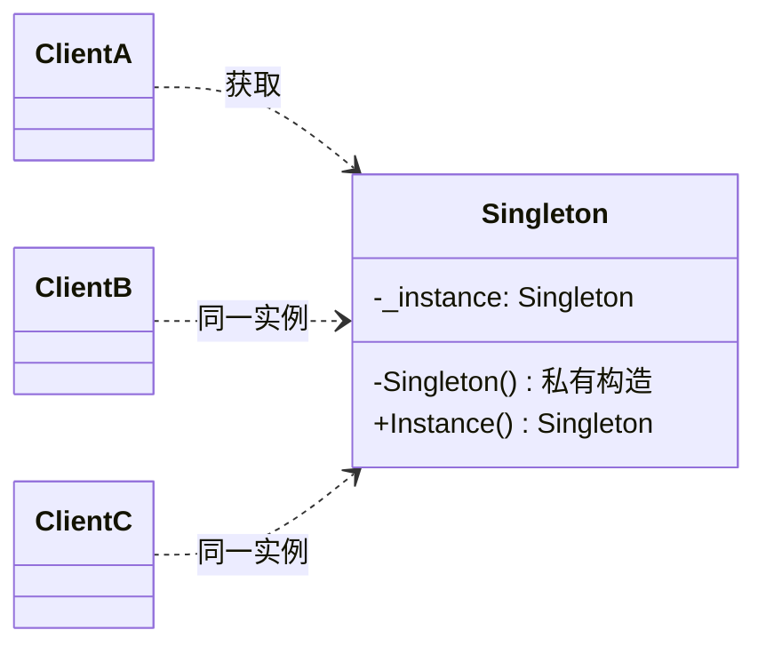
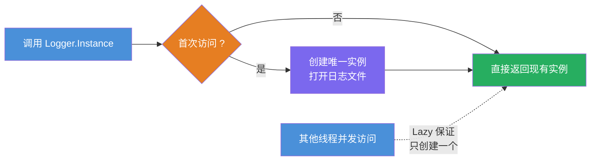
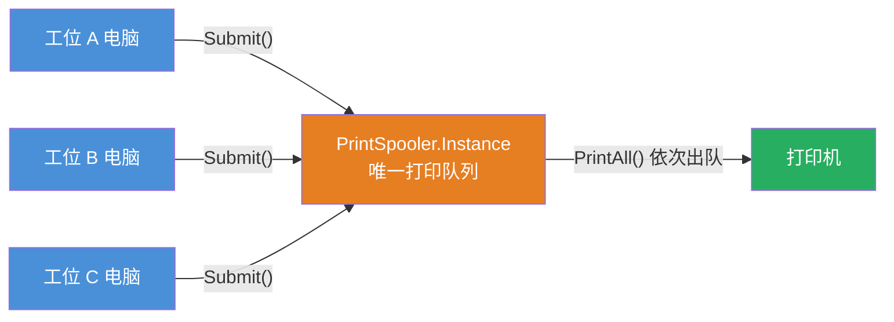

# 单例模式（Singleton Pattern）

[TOC]

## 一、📖 概述

单例模式是**创建型设计模式**，确保一个类**只有一个实例**，并提供一个**全局访问点**。

核心思想：私有构造函数堵死外部 `new`，类自身持有并管控唯一实例，外部只能通过静态入口获取——多次获取、多线程获取，拿到的都是同一个对象。

<br/>

## 二、🧩 模式解析

### 2.1 类关系图



| 关键角色 | 说明 |
| --- | --- |
| **私有构造函数** | 阻止外部通过 `new` 创建实例 |
| **静态实例字段** | 保存唯一的实例引用 |
| **全局访问点** | 静态属性/方法，外部获取实例的唯一入口 |

### 2.2 三种实现方式对比

| 实现方式 | 初始化时机 | 线程安全 | 推荐场景 |
| --- | --- | --- | --- |
| **懒汉式 `Lazy<T>`** | 首次访问时 | CLR 保证 | **首选方案**，简洁安全 |
| **饿汉式（静态字段）** | 类加载时 | CLR 保证 | 启动就需要的重资源 |
| **双重检查锁定 DCL** | 首次访问时 | 手动加锁 | 了解即可，实际开发用 `Lazy<T>` 替代 |

### 2.3 核心代码

**① 懒汉式 `Lazy<T>`（首选）**：首次访问才创建，CLR 保证线程安全

```csharp
class Singleton
{
    // 延迟初始化：首次访问 .Value 时才执行工厂委托
    static readonly Lazy<Singleton> _instance = new(() => new Singleton());

    Singleton() { }                                // 私有构造，堵死外部 new

    static Singleton Instance => _instance.Value;  // 全局访问点
}
```

**② 饿汉式（静态字段）**：类加载时立即创建，天生线程安全

```csharp
class Singleton
{
    // 类加载即创建，CLR 保证静态初始化只执行一次
    static readonly Singleton _instance = new Singleton();

    Singleton() { }

    static Singleton Instance => _instance;
}
```

**③ 双重检查锁定 DCL（了解即可）**：手动版的懒汉式，`Lazy<T>` 出现前的经典写法

```csharp
class Singleton
{
    static Singleton? _instance;                   // .NET 9+ 内存模型下无需 volatile
    static readonly Lock _lock = new();            // .NET 9+ 用 System.Threading.Lock 替代 object

    static Singleton Instance
    {
        get
        {
            if (_instance is null)                 // 第一次检查：无锁快速路径
                lock (_lock)                       // Lock 类型由编译器生成更高效的作用域锁
                    if (_instance is null)         // 第二次检查：防并发重复创建
                        _instance = new Singleton();
            return _instance;
        }
    }

    Singleton() { }
}
```

> 三种写法的骨架完全一致：私有构造 + 静态实例 + 全局访问点，差别只在"实例何时创建、如何保证并发安全"。

### 2.4 关键解析

**调用者无感知**：调用者只依赖 `Instance` 静态入口，不关心实例何时创建、如何保证唯一，实现方式可自由替换（开闭原则）。

**与静态类的区别**：

| 对比维度 | 单例类 | 静态类（static class） |
| --- | --- | --- |
| 实例 | 存在唯一实例，可作为对象传递 | 无实例 |
| 接口与继承 | 可实现接口、可注入 | 均不支持 |
| 生命周期 | 可延迟创建、可按需释放 | 随进程常驻 |
| 适用 | 有状态的对象（日志器、连接池） | 无状态工具函数集合 |

<br/>

## 三、💻 代码示例

### 3.1 懒汉式：日志记录器

> 场景：全局日志器持有文件句柄等重资源，用 `Lazy<T>` 推迟到首次访问才创建；多线程并发首次访问，CLR 保证只初始化一次。



| 角色 | 文件 |
| --- | --- |
| 单例类 | [`Logger/Logger.cs`](Logger/Logger.cs) |
| 客户端 | [`Program.cs`](Program.cs) |

### 3.2 饿汉式：配置管理器

> 场景：配置管理器启动即加载，静态字段在类加载时创建实例，CLR 天然保证线程安全，无需任何锁。


| 角色 | 文件 |
| --- | --- |
| 单例类 | [`ConfigManager/ConfigManager.cs`](ConfigManager/ConfigManager.cs) |
| 客户端 | [`Program.cs`](Program.cs) |

### 3.3 生活场景：办公打印机

> 场景：全办公室共用一台打印机，`PrintSpooler` 维护唯一任务队列；若出现多个队列实例，不同电脑的文档会互相看不见，打印顺序失控。



| 角色 | 文件 |
| --- | --- |
| 单例类 | [`PrintSpooler/PrintSpooler.cs`](PrintSpooler/PrintSpooler.cs) |
| 客户端 | [`Program.cs`](Program.cs) |

### 3.4 运行结果

```bash
========== 单例模式 (Singleton Pattern) ==========
确保一个类只有一个实例，并提供全局访问点

--- 懒汉式 Lazy<T>: 日志记录器 ---
>> 准备就绪，日志器尚未创建
[初始化] 打开日志文件 app-010754.log（仅此一次）
>> 4 个线程拿到同一实例: True
[INFO] 服务启动
[INFO] 处理用户请求

--- 饿汉式 静态字段: 配置管理器 ---
[初始化] 从 appsettings.json 加载配置（类加载时执行）
>> db.host = localhost
>> db.port = 5432

--- 生活场景: 办公室打印机 ---
[初始化] 打印服务已启动，等待任务入队
工位A 提交打印: 季度报表.pdf
工位B 提交打印: 旅行攻略.docx
工位C 提交打印: 发票.xlsx
正在打印: 季度报表.pdf
正在打印: 旅行攻略.docx
正在打印: 发票.xlsx
```

<br/>

## 四、📝 小结

- **核心思想**：私有构造 + 静态实例 + 全局访问点，保证唯一实例

- **三种实现**：`Lazy<T>` 延迟且线程安全（首选）、饿汉式启动即建、DCL 了解即可

- **注意事项**：单例即全局状态，过度使用导致测试困难、依赖隐藏；.NET 开发中优先考虑用依赖注入管理生命周期
