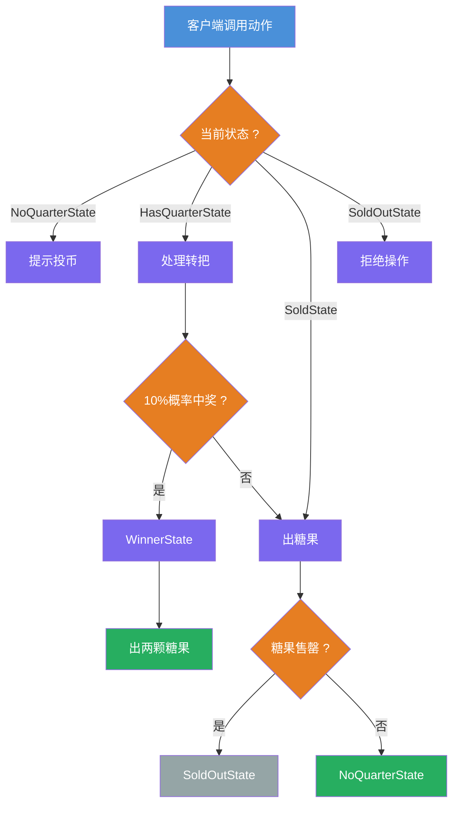
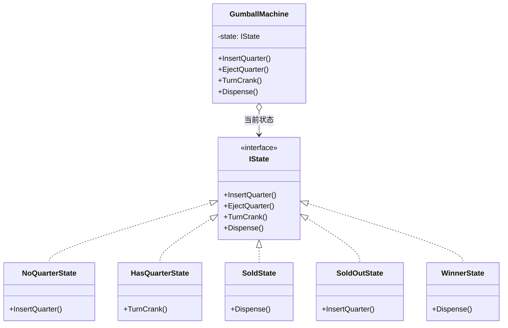

# 状态模式教程

[TOC]

## 一、📖 概述

状态模式是**行为型设计模式**，允许对象在其**内部状态改变时改变自身行为**，看起来像对象换了一个类。

核心思想：将状态封装为独立的状态对象，上下文对象将动作委托给当前状态对象，由状态对象自身决定下一步切换到哪个状态。状态转换逻辑分散在各状态类中，避免了大量条件判断。

### 核心特性

- **状态封装**：每个状态是一个独立的类，持有自己的行为逻辑

- **行为随状态变化**：同一动作在不同状态下表现不同

- **职责清晰**：状态转换逻辑分散到各状态类，而非集中在一个类中

- **符合开闭原则**：新增状态只需新增状态类，无需修改已有状态

<br/>

## 二、📐 结构图解

### 2.1 状态转换流程



### 2.2 类关系



<br/>

## 三、💻 代码实现

以糖果机为例：糖果机有四个状态（无币、有币、售出、售罄），每个状态下可执行的动作和转换规则不同。

### 3.1 状态接口

```csharp
// 状态接口，定义所有可能的动作
public interface IState
{
    void InsertQuarter();   // 投币
    void EjectQuarter();    // 退币
    void TurnCrank();       // 转把
    void Dispense();        // 出糖
}
```

### 3.2 具体状态类

```csharp
// 无币状态：投币后切换到有币状态
public class NoQuarterState : IState
{
    public void InsertQuarter()
    {
        Console.WriteLine("投币成功");
        _machine.SetState(_machine.HasQuarterState); // 状态切换
    }

    public void EjectQuarter() => Console.WriteLine("还没投币");
    public void TurnCrank()    => Console.WriteLine("请先投币");
    public void Dispense()     => Console.WriteLine("请先投币");
}

// 有币状态：转把有10%概率中奖
public class HasQuarterState : IState
{
    public void TurnCrank()
    {
        if (rnd.NextDouble() < 0.1)
            _machine.SetState(_machine.WinnerState);  // 10%中奖
        else
            _machine.SetState(_machine.SoldState);    // 正常售出
    }
}
```

### 3.3 上下文类

```csharp
// 糖果机：持有当前状态，委托动作给状态对象
public class GumballMachine
{
    private IState _state;

    public IState NoQuarterState  { get; }
    public IState HasQuarterState { get; }
    public IState SoldState       { get; }
    public IState SoldOutState    { get; }
    public IState WinnerState     { get; }

    public void InsertQuarter() => _state.InsertQuarter();
    public void EjectQuarter()  => _state.EjectQuarter();
    public void TurnCrank()     => _state.TurnCrank();
    public void Dispense()      => _state.Dispense();
}
```

### 3.4 客户端使用

```csharp
// 客户端只需操作糖果机，不感知状态细节
var machine = new GumballMachine();
machine.InsertQuarter();  // 投币
machine.TurnCrank();      // 转把
machine.Dispense();       // 出糖
```

<br/>

## 四、🔍 核心解析

### 4.1 状态接口

`IState` 定义了所有可能动作的契约。每个具体状态类实现这些动作，根据自身逻辑决定行为和状态切换。

### 4.2 上下文委托

`GumballMachine` 持有当前状态对象 `_state`，所有动作直接委托给 `_state.InsertQuarter()` 等方法。上下文不包含状态判断逻辑。

### 4.3 状态自切换

状态切换由状态类自身决定。例如 `NoQuarterState.InsertQuarter()` 收币后主动切换到 `HasQuarterState`，实现了"状态决定行为，行为决定下一状态"。

### 4.4 对比传统方式

传统实现用 `if-else` 或 `switch` 在一个类中判断所有状态，代码随状态增多急剧膨胀。状态模式将判断逻辑分散到各状态类，每个类只关心自己的行为。

<br/>

## 五、🎯 应用场景

### 5.1 适用场景

- 对象行为随内部状态变化而不同

- 状态转换规则复杂，且可能扩展

- 代码中存在大量与状态相关的条件分支

### 5.2 实际案例

- **游戏AI**：NPC在巡逻、追击、逃跑等状态间切换

- **订单系统**：订单在待支付、已支付、已发货、已完成等状态间流转

- **网络连接**：TCP连接在LISTEN、ESTABLISHED、CLOSE_WAIT等状态间转换

<br/>

## 六、⚖️ 优缺点分析

### 6.1 优点

- **职责分离**：每个状态的行为独立封装在一个类中

- **消除条件分支**：用多态替代大量 `if-else` 或 `switch`

- **易于扩展**：新增状态只需新增状态类，无需修改已有状态

- **状态转换显式化**：每个状态类明确知道可切换到哪些状态

### 6.2 缺点

- **类数量增多**：每个状态需要一个独立的类

- **状态分散**：状态转换逻辑分散在各状态类中，整体流程不易把握

- **适用范围有限**：状态数量少时，直接用条件分支更简单

<br/>

## 七、📝 总结

- **核心思想**：将状态封装为独立对象，行为随状态变化

- **关键角色**：上下文（GumballMachine）、状态接口（IState）、具体状态类

- **适用场景**：对象行为随状态变化，状态转换规则复杂

- **注意事项**：状态数量少时，简单的条件分支可能更直观
