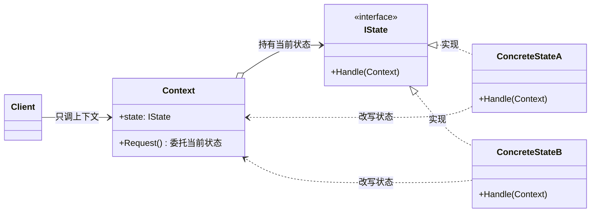
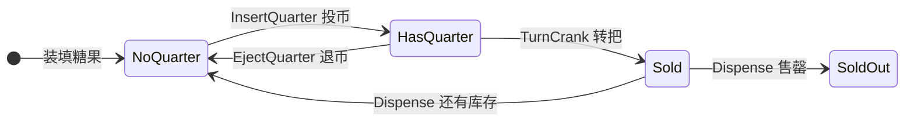
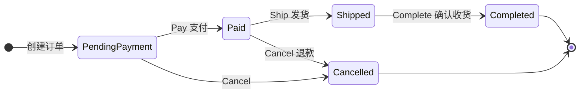

# 状态模式（State Pattern）

[TOC]

## 一、📖 概述

状态模式是**行为型设计模式**，允许对象在**内部状态改变时改变自身行为**，看起来就像对象换了一个类。

核心思想：把每个状态封装成独立的状态对象，上下文把动作委托给当前状态对象，由状态对象自己决定"做什么、下一步切到哪"。转换逻辑分散在各状态类中，用多态替代大量 `if-else`/`switch` 分支。

<br/>

## 二、🧩 模式解析

### 2.1 类关系图



| 关键角色 | 说明 |
| --- | --- |
| **上下文（Context）** | 持有当前状态对象引用，将所有动作委托给它，自身不含状态判断 |
| **状态接口（State）** | 定义所有可能动作的契约 |
| **具体状态类（Concrete State）** | 实现特定状态下的行为，并决定切换到哪个状态 |

### 2.2 核心代码

```csharp
// 上下文 Context：持有当前状态，动作全部委托，自身零分支
class Context
{
    internal State _state;                       // 当前状态对象

    void Request() => _state.Handle(this);       // 委托给当前状态
}

// 状态接口：定义所有动作的契约
interface State
{
    void Handle(Context ctx);
}

// 具体状态 A：实现本状态行为，并决定切换到哪
class ConcreteStateA : State
{
    void Handle(Context ctx)
    {
        // ... 本状态下的行为
        ctx._state = ctx.StateB;                 // 状态对象自行改写上下文状态
    }
}
```

> 协作方式：客户端只调 `Context.Request()`；上下文转手交给当前状态对象，状态对象执行行为后回写 `ctx._state` 完成流转——"状态决定行为，行为决定下一状态"。

### 2.3 与传统 switch 写法对比

传统写法把所有状态的分支集中在一个类里，状态越多越臃肿：

```csharp
// 传统写法：每加一种状态，所有 switch 都要改（违反开闭原则）
public void InsertQuarter()
{
    switch (_state)
    {
        case State.NoQuarter: _state = State.HasQuarter; break;
        case State.HasQuarter: Console.WriteLine("不能多投"); break;
        case State.Sold:       Console.WriteLine("正在出货"); break;
        case State.SoldOut:    Console.WriteLine("已售罄");   break;
    }
}
```

状态模式下每个状态只关心自己的行为，新增状态 = 新增一个类，已有代码零改动。

### 2.4 与策略模式的区别

两者结构几乎相同（上下文 + 接口 + 多实现），但意图截然不同：

| 对比维度 | 状态模式 State | 策略模式 Strategy |
| --- | --- | --- |
| 核心目的 | 行为随**内部状态**自动变化 | 客户端**主动选择**算法并替换 |
| 切换驱动者 | 状态对象自己改写上下文状态 | 外部调用者显式 Set |
| 状态间感知 | 知道可切换到哪些状态（流转图） | 策略之间互不知道（平级替换） |
| 判断口诀 | 对象内部事件驱动 → 状态 | 外部调用者决定 → 策略 |

<br/>

## 三、💻 代码示例

### 3.1 经典场景：自动糖果机

> 场景：糖果机有未投币、已投币、出货、售罄四种状态，同一动作在不同状态下结果不同——未投币转把被拒绝，出货后视库存自动切回或售罄。



| 角色 | 文件 |
| --- | --- |
| 状态接口 | [`GumballMachine/IState.cs`](GumballMachine/IState.cs) |
| 上下文 | [`GumballMachine/GumballMachine.cs`](GumballMachine/GumballMachine.cs) |
| 具体状态 | [`GumballMachine/NoQuarterState.cs`](GumballMachine/NoQuarterState.cs) 等 4 个 |
| 客户端 | [`Program.cs`](Program.cs) |

### 3.2 软件项目：电商订单流转

> 场景：订单在待支付 → 已支付 → 已发货 → 已完成间流转，可随时取消；未支付发货被拒、已发货无法取消、取消/完成后是终结态——电商系统中最典型的状态机。



| 角色 | 文件 |
| --- | --- |
| 状态接口 | [`Order/IOrderState.cs`](Order/IOrderState.cs) |
| 上下文 | [`Order/Order.cs`](Order/Order.cs) |
| 具体状态 | [`Order/PendingPaymentState.cs`](Order/PendingPaymentState.cs) 等 5 个 |
| 客户端 | [`Program.cs`](Program.cs) |

### 3.3 运行结果

```bash
========== 状态模式 (State Pattern) ==========
允许对象在内部状态改变时改变其行为

--- 经典场景: 自动糖果机 ---
[糖果机] 装填 2 颗糖果
>> 转动摇杆（未投币）
[拒绝] 请先投币再转动摇杆
[拒绝] 无法出货
>> 投币
[投币成功] 已投入硬币
>> 再次投币
[拒绝] 不能投入更多硬币
>> 转动摇杆
[转动] 摇杆转动中
[出货] 一颗糖果滚落出来（剩余 1 颗）
>> 投币 + 转动摇杆
[投币成功] 已投入硬币
[转动] 摇杆转动中
[出货] 一颗糖果滚落出来（剩余 0 颗）
[售罄] 糖果已售完
>> 投币（已售罄）
[拒绝] 糖果已售罄

--- 软件项目: 电商订单流转 ---
[创建] 订单 SO-1001 已创建，等待支付
>> 支付
[支付成功] 订单已支付，等待发货
>> 发货
[已发货] 商品运输中
>> 确认收货
[已完成] 确认收货，交易完成
>> 完成后取消
[拒绝] 订单已完成，无法取消

[创建] 订单 SO-1002 已创建，等待支付
>> 未支付直接发货
[拒绝] 请先支付
>> 支付
[支付成功] 订单已支付，等待发货
>> 支付后取消
[已取消] 订单已取消，退款将原路退回
>> 取消后再支付
[拒绝] 订单已取消
```

<br/>

## 四、📝 小结

- **核心思想**：状态封装为对象，上下文委托动作，状态类自行决定行为与流转

- **两个示例**：糖果机展示"同动作不同状态不同结果"，订单展示软件项目中的状态机与非法操作拦截

- **注意事项**：状态数量少时直接用条件分支更直观；状态类多了整体流转图不易把握，可配合状态图文档化
