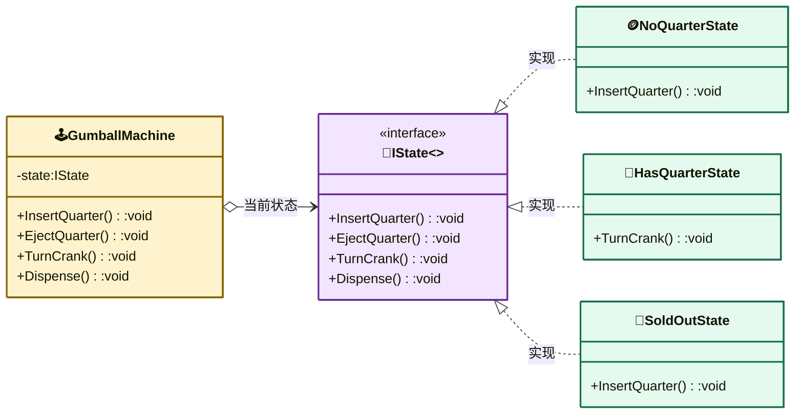

---
AIGC:
    Label: "1"
    ContentProducer: 001191440300708461136T1XGW3
    ProduceID: 6731a671e9c59b3546535911c94fc1c6_6b15e9bc9bf011f1a98a525400f8a581
    ReservedCode1: 2JzHgGyjSSdLIhBsGKXaCn7wq6hFWCDK53tL8mcIT3LbNlNp4CAwUijjek8eeKeUY3gboYWCEULzdFQwwxuAKgXs5ggbes9sAsvz8K4RwKWxgaNgxxvE8OWKkw85uMtFGD4Lc5WICgshPV8A6Xm0p3TD0XpLXktb5mYqGFDAgjWMikzR4LAipDixwOM=
    ContentPropagator: 001191440300708461136T1XGW3
    PropagateID: 6731a671e9c59b3546535911c94fc1c6_6b15e9bc9bf011f1a98a525400f8a581
    ReservedCode2: 2JzHgGyjSSdLIhBsGKXaCn7wq6hFWCDK53tL8mcIT3LbNlNp4CAwUijjek8eeKeUY3gboYWCEULzdFQwwxuAKgXs5ggbes9sAsvz8K4RwKWxgaNgxxvE8OWKkw85uMtFGD4Lc5WICgshPV8A6Xm0p3TD0XpLXktb5mYqGFDAgjWMikzR4LAipDixwOM=
---

# 状态模式（State Pattern）

> **核心思想**：允许对象在其**内部状态改变时改变自身行为**，看起来像对象换了一个类。状态被封装为独立的状态对象，由状态对象自身决定下一步切换到哪个状态。

## 解决什么问题

糖果机有四个状态（没有25分钱 / 有25分钱 / 售出糖果 / 糖果售罄），每个状态下可执行的动作和转换规则不同。若用 if-else 把所有状态转换堆在一个类里，代码会随状态增多急剧膨胀。状态模式将每个状态做成独立类，机器对象只负责委托给"当前状态"对象，状态切换逻辑分散到各状态类中，职责清晰、易于扩展。

## 主要参与者

| 角色 | 本示例类 | 职责 |
| --- | --- | --- |
| 上下文 Context | `GumballMachine` | 持有当前状态对象，将动作委托给它 |
| 状态 State | `IState` | 定义所有可能动作的接口 |
| 具体状态 | `NoQuarterState` / `HasQuarterState` / `SoldState` / `SoldOutState` / `WinnerState` | 各自实现动作并负责状态切换 |
| 客户端 Client | `Program` | 操作糖果机，不感知状态细节 |

## 类图



## 源码结构

目录下源码文件与职责对应：

- **IState.cs**：状态接口，定义 `InsertQuarter / EjectQuarter / TurnCrank / Dispense` 四类动作。
- **GumballMachine.cs**：上下文，持有当前状态 `_state`，所有动作直接 `_state.InsertQuarter()` 等委托；同时暴露各状态常量与 `ReleaseBall()` 供状态类切换使用。
- **NoQuarterState.cs**：无币状态。`InsertQuarter` 收币并切换到 `HasQuarterState`；其余动作提示无效。
- **HasQuarterState.cs**：有币状态。`EjectQuarter` 退币回无币；`TurnCrank` 有 10% 概率进入 `WinnerState`（中奖）否则进入 `SoldState`。
- **SoldState.cs**：售出状态。`Dispense` 出糖果，售罄则转 `SoldOutState` 否则回 `NoQuarterState`。
- **SoldOutState.cs**：售罄状态。任何操作均拒绝。
- **WinnerState.cs**：中奖状态。`Dispense` 释放两颗糖果后再判断转场。
- **Legacy/State.cs / Legacy/GumballMachine.cs**：未应用状态的旧版对比实现（用条件判断），可对照体会状态模式的改进。
- **Program.cs**：演示投币→转把→出糖→中奖的完整流程。

```csharp
// HasQuarterState.TurnCrank() 核心代码
if (rnd.NextDouble() < 0.1) {
    _machine.SetState(_machine.WinnerState);   // 10% 中奖
} else {
    _machine.SetState(_machine.SoldState);
}
```
*（内容由AI生成，仅供参考）*
