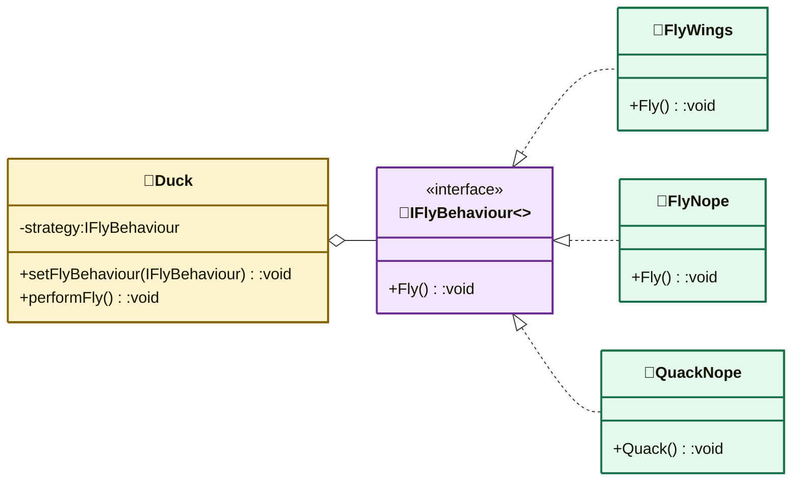

# 策略模式（Strategy Pattern）

> **核心思想**：定义一族**可互换的算法**，分别封装成独立类，并让算法能够**在运行时自由切换**。客户端针对接口编程，而不是针对具体实现。

## 解决什么问题

鸭子有飞行、鸣叫两种行为，不同鸭子行为各异（飞/不飞、嘎嘎/吱吱/安静）。若用继承把行为写死在子类里，新增行为需反复改动父类与子类，且"飞行能力"无法复用。策略模式把"行为"抽象成 `IFlyBehaviour` / `IQuackBehaviour` 接口，鸭子**组合**这些策略对象，运行时通过 `SetFlyBehaviour` 等切换行为，实现"多用组合、少用继承"。

## 主要参与者

| 角色 | 本示例类 | 职责 |
| --- | --- | --- |
| 策略 Strategy | `IFlyBehaviour` / `IQuackBehaviour` | 行为算法接口 |
| 具体策略 | `FlyWings` / `FlyNope` / `QuackNormal` / `QuackSqueak` / `QuackNope` | 各算法的具体实现 |
| 上下文 Context | `Duck`（`MallardDuck`） | 组合策略对象，委托行为，可动态更换 |
| 客户端 Client | `Program` | 配置鸭子并触发行为 |

## 类图



## 源码结构

目录下源码文件与职责对应：

- **IFlyBehaviour.cs / IQuackBehaviour.cs**：策略接口。
- **FlyWings.cs / FlyNope.cs / QuackNormal.cs / QuackSqueak.cs / QuackNope.cs**：具体策略，各实现一种行为，可被任意鸭子复用。
- **Program.cs**：在同一文件中定义 `Duck` 与 `MallardDuck`。`Duck` 组合两个策略字段，提供 `SetFlyBehaviour` / `SetQuackBehaviour` 动态更换；`MallardDuck` 构造时装配 `FlyWings` + `QuackNormal`。
- **Program.cs 的 Main**：创建 `MallardDuck` 演示默认行为，再调用 `SetFlyBehaviour(new FlyNope())` 演示运行时切换为"不会飞"。

```csharp
// Program.cs 核心代码
var duck = new MallardDuck();
duck.PerformQuack();   // Quack!
duck.PerformFly();     // Flying With Wings!
duck.SetFlyBehaviour(new FlyNope());   // 运行时切换策略
duck.PerformFly();     // Can't Fly!
```
