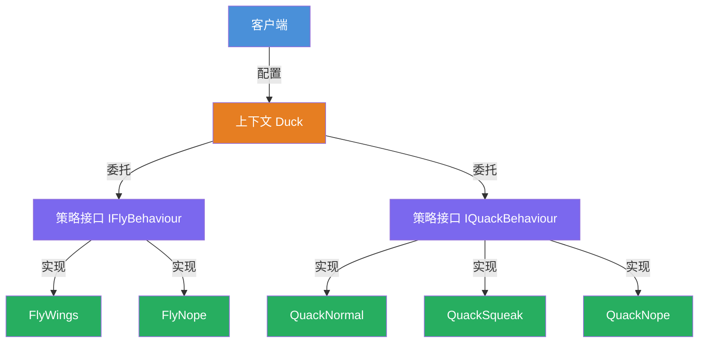
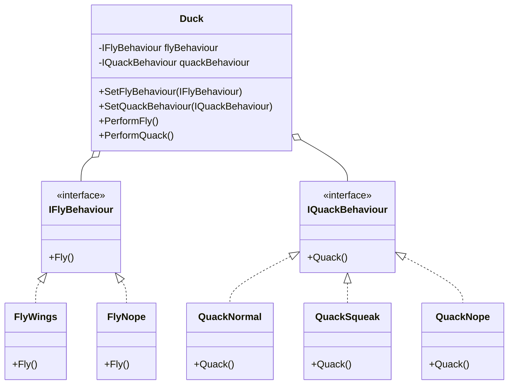

# 策略模式教程

[TOC]


## 一、📖 概述

策略模式是**行为型设计模式**，定义一族**可互换的算法**，分别封装成独立类，并让算法能够在**运行时自由切换**。

核心思想：将算法的定义与使用分离，客户端针对抽象接口编程，不关心具体实现。通过组合替代继承，鸭子可以动态更换飞行和鸣叫行为。

### 核心特性

- **封装性**：每种算法封装为独立类，互不干扰

- **可替换**：运行时通过 `Set` 方法动态切换算法

- **符合开闭原则**：新增算法只需新增类，无需修改现有代码

- **多用组合少用继承**：行为通过组合注入，而非继承绑定

<br/>

## 二、📐 结构图解

### 2.1 整体结构



### 2.2 类关系



<br/>

## 三、💻 代码实现

以鸭子行为为例：不同鸭子有不同的飞行和鸣叫行为，通过策略模式实现行为的动态切换。

### 3.1 策略接口

```csharp
// 飞行策略接口
public interface IFlyBehaviour
{
    void Fly();
}

// 鸣叫策略接口
public interface IQuackBehaviour
{
    void Quack();
}
```

### 3.2 具体策略

```csharp
// 用翅膀飞
public class FlyWings : IFlyBehaviour
{
    public void Fly() => Console.WriteLine("Flying With Wings!");
}

// 不会飞
public class FlyNope : IFlyBehaviour
{
    public void Fly() => Console.WriteLine("Can't Fly!");
}

// 正常嘎嘎叫
public class QuackNormal : IQuackBehaviour
{
    public void Quack() => Console.WriteLine("Quack!");
}

// 吱吱叫
public class QuackSqueak : IQuackBehaviour
{
    public void Quack() => Console.WriteLine("Squeak!");
}

// 不会叫
public class QuackNope : IQuackBehaviour
{
    public void Quack() => Console.WriteLine("<< Silence >>");
}
```

### 3.3 上下文与客户端

```csharp
// 鸭子基类：组合策略对象
public class Duck
{
    protected IFlyBehaviour _flyBehaviour;
    protected IQuackBehaviour _quackBehaviour;

    public void SetFlyBehaviour(IFlyBehaviour fb) => _flyBehaviour = fb;
    public void SetQuackBehaviour(IQuackBehaviour qb) => _quackBehaviour = qb;

    public void PerformFly() => _flyBehaviour.Fly();
    public void PerformQuack() => _quackBehaviour.Quack();
}

// 具体鸭子：构造时装配默认策略
public class MallardDuck : Duck
{
    public MallardDuck()
    {
        _flyBehaviour = new FlyWings();
        _quackBehaviour = new QuackNormal();
    }
}
```

### 3.4 运行时切换

```csharp
var duck = new MallardDuck();
duck.PerformQuack();   // Quack!
duck.PerformFly();     // Flying With Wings!

// 运行时切换为"不会飞"
duck.SetFlyBehaviour(new FlyNope());
duck.PerformFly();     // Can't Fly!
```

**运行结果**：
```
Quack!
Flying With Wings!
Can't Fly!
```

<br/>

## 四、🔍 核心解析

### 4.1 策略接口

`IFlyBehaviour` 和 `IQuackBehaviour` 定义了行为的抽象契约。鸭子只依赖接口，不关心具体实现，新增行为只需新增实现类。

### 4.2 上下文委托

`Duck` 持有两个策略引用，将 `PerformFly` / `PerformQuack` 委托给对应策略对象执行，自身不包含行为逻辑。

### 4.3 运行时切换

通过 `SetFlyBehaviour` / `SetQuackBehaviour` 方法，客户端可在运行时替换策略对象，无需创建新鸭子实例。

<br/>

## 五、🎯 应用场景

### 5.1 适用场景

- 多种算法需要在运行时动态切换

- 不同对象共享相同行为接口但实现各异

- 需要用组合替代继承来消除类爆炸

### 5.2 实际案例

- **排序策略**：根据数据规模选择冒泡、快排、归并

- **支付方式**：支付宝、微信、银行卡动态切换

- **路线规划**：最快、最短、最便宜路线切换

<br/>

## 六、⚖️ 优缺点分析

### 6.1 优点

- **算法可替换**：运行时动态切换，无需修改上下文代码

- **符合开闭原则**：新增算法不修改已有类

- **消除条件分支**：用多态替代 `if-else` / `switch` 选择算法

### 6.2 缺点

- **类数量增多**：每种算法需要一个独立类

- **客户端需感知策略**：调用方需要知道有哪些策略可选

<br/>

## 七、📝 总结

- **核心思想**：定义一族算法，封装成独立类，运行时自由切换

- **关键角色**：策略接口、具体策略、上下文

- **适用场景**：多种算法动态切换，需要消除继承带来的类爆炸

- **注意事项**：策略类数量随算法增长，设计时需合理划分粒度
