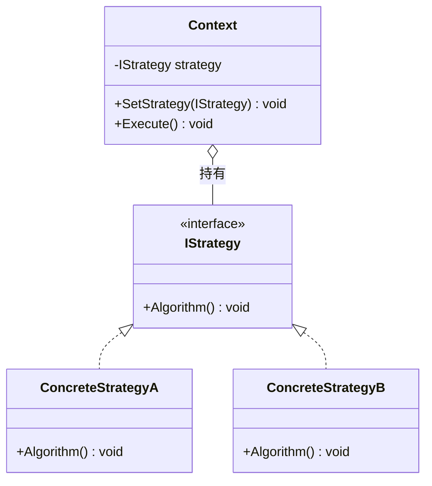
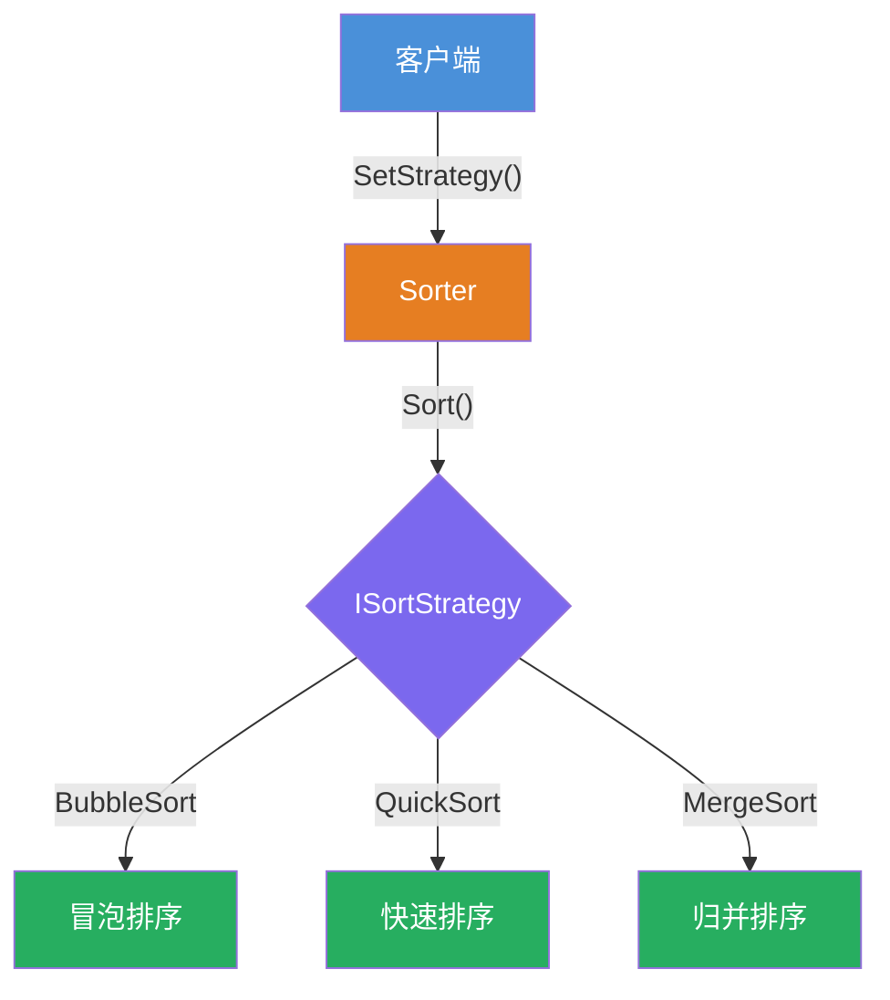
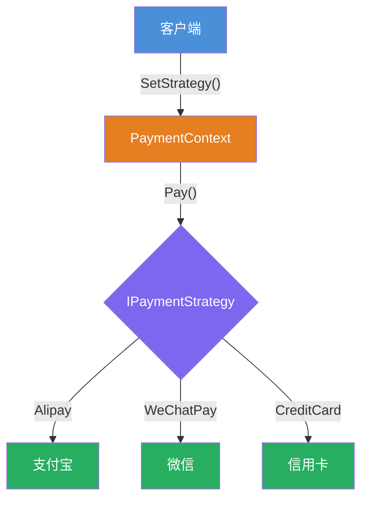
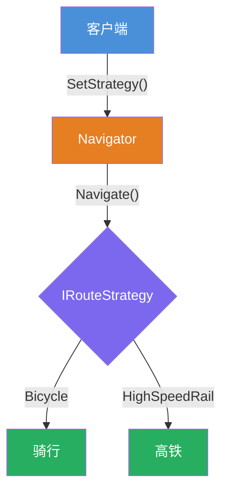

# 策略模式（Strategy Pattern）

[TOC]

## 一、📖 概述

策略模式是**行为型设计模式**，定义一族**可互换的算法**，分别封装成独立类，让算法能够在**运行时自由切换**。

核心思想：将算法的定义与使用分离，客户端针对抽象接口编程，通过组合替代继承实现行为的动态替换。

<br/>

## 二、🧩 模式解析

### 2.1 类关系图



### 2.2 三大角色

| 角色 | 职责 | 设计要点 |
| --- | --- | --- |
| **策略接口 Strategy** | 定义算法的抽象契约 | 所有具体策略遵循同一套接口 |
| **具体策略 ConcreteStrategy** | 实现特定算法 | 每个策略独立封装，互不干扰 |
| **上下文 Context** | 持有策略引用，委托执行 | 运行时可切换策略，自身不含算法逻辑 |

### 2.3 关键解析

**运行时切换**：通过 `SetStrategy()` 方法，客户端可在运行时替换策略对象，无需创建新的上下文实例。

**消除条件分支**：用多态替代 `if-else` / `switch` 选择算法，符合开闭原则。

**与状态模式的区别**：

| 对比 | 策略模式 | 状态模式 |
| --- | --- | --- |
| 意图 | 客户端**主动选择**算法 | 对象**被动**随内部状态变化 |
| 切换时机 | 由外部决定 | 由内部自动切换 |
| 典型场景 | 支付方式、排序算法 | 订单流转、TCP连接状态 |

<br/>

## 三、💻 代码示例

### 3.1 排序策略

> 场景：`Sorter` 持有 `ISortStrategy` 引用，可运行时切换冒泡、快排、归并。



| 角色 | 文件 |
| --- | --- |
| 策略接口 | [`Sort/ISortStrategy.cs`](Sort/ISortStrategy.cs) |
| 冒泡排序 | [`Sort/BubbleSort.cs`](Sort/BubbleSort.cs) |
| 快速排序 | [`Sort/QuickSort.cs`](Sort/QuickSort.cs) |
| 归并排序 | [`Sort/MergeSort.cs`](Sort/MergeSort.cs) |

### 3.2 支付方式

> 场景：`PaymentContext` 持有 `IPaymentStrategy` 引用，可动态切换支付宝、微信、信用卡。



| 角色 | 文件 |
| --- | --- |
| 策略接口 | [`Payment/IPaymentStrategy.cs`](Payment/IPaymentStrategy.cs) |
| 支付宝 | [`Payment/Alipay.cs`](Payment/Alipay.cs) |
| 微信支付 | [`Payment/WeChatPay.cs`](Payment/WeChatPay.cs) |
| 信用卡 | [`Payment/CreditCard.cs`](Payment/CreditCard.cs) |

### 3.3 路线规划

> 场景：`Navigator` 持有 `IRouteStrategy` 引用，根据距离和场景切换骑行或高铁。



| 角色 | 文件 |
| --- | --- |
| 策略接口 | [`Routing/IRouteStrategy.cs`](Routing/IRouteStrategy.cs) |
| 骑行 | [`Routing/Bicycle.cs`](Routing/Bicycle.cs) |
| 高铁 | [`Routing/HighSpeedRail.cs`](Routing/HighSpeedRail.cs) |
| 导航上下文 | [`Routing/Navigator.cs`](Routing/Navigator.cs) |

### 3.4 运行结果

```bash
========== 策略模式 (Strategy Pattern) ==========
定义一族算法，封装成独立类，运行时自由切换

--- 排序策略 ---
冒泡排序完成
快速排序完成
归并排序完成

--- 支付方式 ---
支付宝支付 100 元
微信支付 200 元
信用卡支付 300 元

--- 路线规划 ---
骑行：公司 → 地铁站（1.5km），预计15分钟
高铁：北京 → 上海（1318km），预计4.5小时
```

<br/>

## 四、📝 小结

- **核心思想**：定义一族算法，封装成独立类，运行时自由切换

- **适用场景**：多种算法动态切换、需要消除继承带来的类爆炸

- **注意事项**：策略类数量随算法增长，设计时需合理划分粒度
