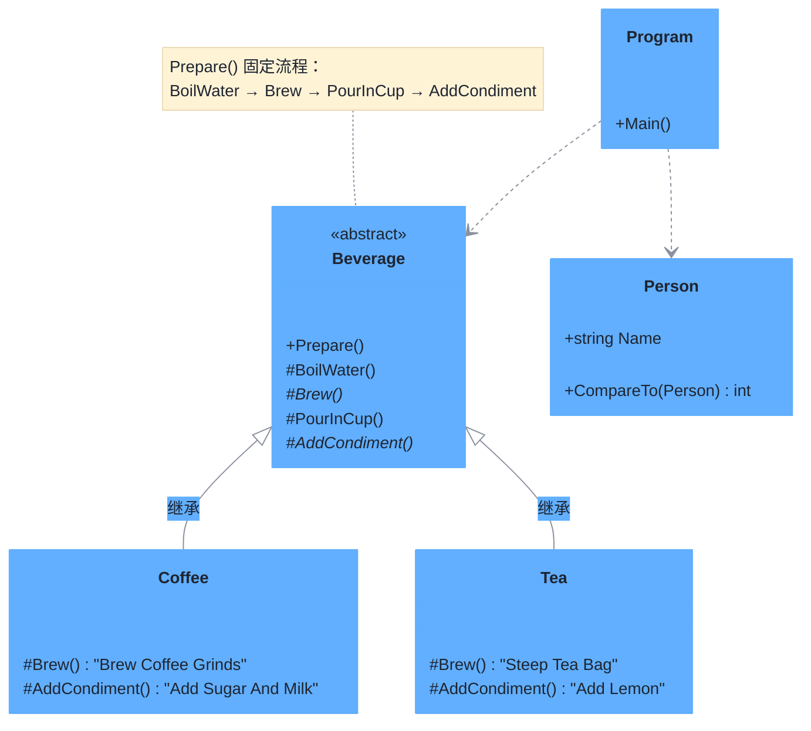

# 模板方法模式（Template Method Pattern）

> **核心思想**：在一个方法中定义算法的**骨架**，将一些步骤**延迟到子类实现**。父类固定流程、子类定制细节，从而在不改变算法结构的前提下复用公共逻辑。

## 解决什么问题

泡咖啡和泡茶步骤高度相似（烧水→冲泡→加料→倒杯），若分别实现会有大量重复代码。模板方法模式把公共骨架放在父类 `Beverage.Prepare()` 中，把"泡什么、加什么料"这类可变步骤抽象成 `Brew()` / `AddCondiment()`，由 `Coffee` / `Tea` 子类各自实现，既消除重复又保留灵活性。

## 主要参与者

| 角色 | 本示例类 | 职责 |
| --- | --- | --- |
| 抽象类 AbstractClass | `Beverage` | 定义模板方法 `Prepare()` 与抽象步骤 |
| 具体类 ConcreteClass | `Coffee` / `Tea` | 实现抽象步骤，定制流程细节 |
| 对比示例 | `Person : IComparable` | 演示 `CompareTo` 模板思路的扩展用法 |

## 类图



## 源码结构

目录下源码文件与职责对应：

- **Beverage.cs**：抽象类。`Prepare()` 为模板方法，固定执行"烧水→冲泡→倒杯→加料"四个步骤；其中 `BoilWater()` / `PourInCup()` 已在父类实现，`Brew()` / `AddCondiment()` 为抽象，交由子类定制。
- **Coffee.cs**：实现 `Brew()`（研磨咖啡）与 `AddCondiment()`（加糖加奶）。
- **Tea.cs**：实现 `Brew()`（浸泡茶包）与 `AddCondiment()`（加柠檬）。
- **Person.cs**：扩展示例，实现 `IComparable`，`CompareTo` 用固定比较流程比较姓名——体现模板方法"固定骨架+延迟步骤"的思路。
- **Program.cs**：分别调用 `Coffee.Prepare()` 与 `Tea.Prepare()`，观察同一骨架下两种饮品的差异化流程。

```csharp
// Beverage.Prepare() 模板方法
public void Prepare() {
    BoilWater();      // 父类实现：烧水
    Brew();           // 子类定制：咖啡研磨 / 茶包浸泡
    PourInCup();      // 父类实现：倒杯
    AddCondiment();   // 子类定制：加糖奶 / 加柠檬
}
```
