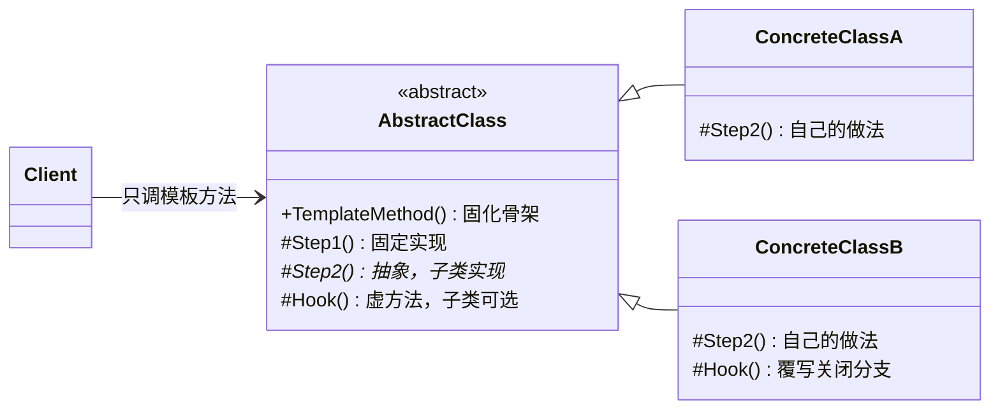
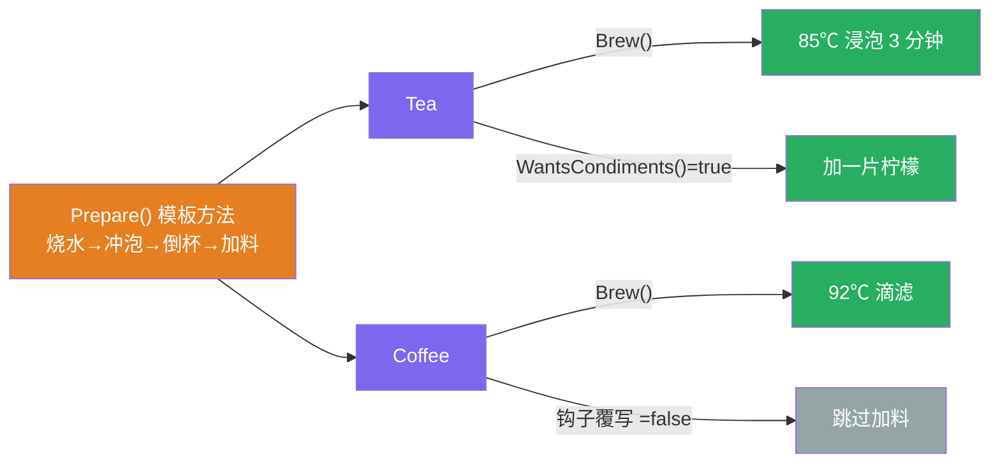
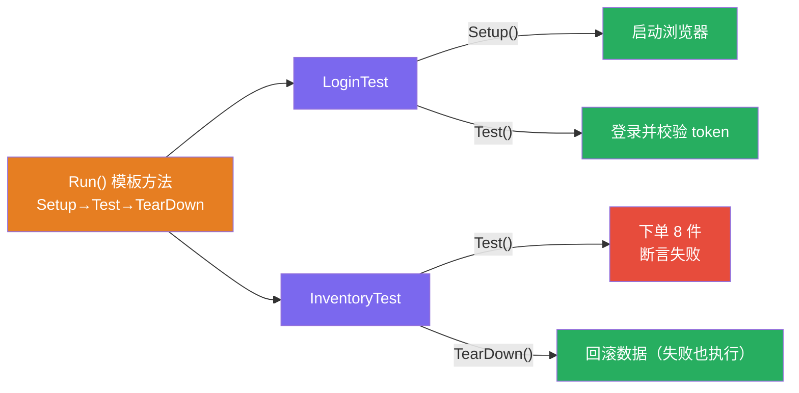

# 模板方法模式（Template Method Pattern）

[TOC]

## 一、📖 概述

模板方法是**行为型设计模式**，在父类中定义一个算法的**骨架**，把某些步骤**延迟到子类**实现。

核心思想：流程怎么走由基类说了算（**不变**），每一步怎么做得看子类（**可变**）。子类覆写少数几个"变化点"，绝不允许改动骨架顺序——茶和咖啡的冲泡都是"烧水→冲泡→倒杯→加料"，差的只是每步的具体做法。

<br/>

## 二、🧩 模式解析

### 2.1 类关系图



| 关键角色 | 说明 | 冲泡示例 |
| --- | --- | --- |
| **模板方法（Template Method）** | 基类中的非虚公开方法，固化步骤顺序 | `Prepare()` |
| **抽象步骤（Primitive Operation）** | 无默认实现，子类必须覆写 | `Brew()`/`AddCondiments()` |
| **固定步骤** | 私有实现，子类无感知 | `BoilWater()`/`PourInCup()` |
| **钩子（Hook）** | 有默认实现的虚方法，控制流程分支 | `WantsCondiments()` |

### 2.2 核心代码

```csharp
abstract class AbstractClass
{
    // 模板方法：公开非虚——子类改不了流程，只能改步骤
    public void TemplateMethod()
    {
        Step1();                          // 固定步骤：基类私有实现
        Step2();                          // 变化步骤：延迟到子类
        if (Hook())                       // 钩子：子类可开启/关闭分支
            Step3();                      // 变化步骤
    }

    private void Step1() { }
    protected abstract void Step2();       // 必须实现
    protected abstract void Step3();       // 必须实现
    protected virtual bool Hook() => true;// 可选覆写
}

// 子类：只回答"每一步怎么做"，不碰"流程怎么走"
class ConcreteClass : AbstractClass
{
    protected override void Step2() { }   // 自己的做法
    protected override void Step3() { }
}
```

> 协作方式：客户端只调 `TemplateMethod()`；基类按固定顺序调用各步骤，遇到抽象步骤就落进子类实现，遇到钩子由子类决定走不走分支——"好莱坞原则：别调用我们，我们会调用你"。

### 2.3 关键解析

**三类步骤的权限设计**是模板方法的精髓：

| 步骤类型 | 修饰 | 子类能做什么 |
| --- | --- | --- |
| 模板方法 | `public` 非虚 | 什么都不做（骨架不可动） |
| 抽象步骤 | `protected abstract` | 必须实现 |
| 钩子 | `protected virtual` | 可覆写可不理（默认行为继续） |

- **模板方法 vs 策略**：模板方法用**继承**换骨架（子类填空），策略用**组合**换算法（整体替换）；骨架稳定填空用模板，整段算法互换用策略（见 [../StrategyPattern](../StrategyPattern/README.md)）
- **BCL/框架中的身影**：xUnit/NUnit 的 `Setup → Test → TearDown`、ASP.NET 的页面生命周期 `Page.Init/Load/Render`、`Stream.Read` 派生类只需实现核心读——到处都是
- **工厂方法常藏在模板方法里**：骨架某步是"创建对象"时，那一步就是工厂方法（见 [../FactoryMethodPattern](../FactoryMethodPattern/README.md)）

<br/>

## 三、💻 代码示例

### 3.1 经典场景：茶与咖啡的冲泡流程

> 场景：HFDP 教材经典——「烧水→冲泡→倒杯→加料」骨架固定；茶 85℃ 浸泡加柠檬，咖啡 92℃ 滴滤加糖奶，咖啡用钩子关闭"加料"分支。



| 角色 | 文件 |
| --- | --- |
| 抽象类（模板方法） | [`Beverages/Beverage.cs`](Beverages/Beverage.cs) |
| 具体类 | [`Beverages/Tea.cs`](Beverages/Tea.cs)、[`Coffee.cs`](Beverages/Coffee.cs) |
| 客户端 | [`Program.cs`](Program.cs) |

### 3.2 软件项目：单元测试框架生命周期

> 场景：`Run()` 固化 Setup → Test → TearDown 生命周期，失败也保证清理——用例只写测试步骤；登录测试通过、库存测试断言失败但 Teardown 照常执行，xUnit 同构。



| 角色 | 文件 |
| --- | --- |
| 抽象类（模板方法） | [`Testing/TestBase.cs`](Testing/TestBase.cs) |
| 具体类 | [`Testing/LoginTest.cs`](Testing/LoginTest.cs)、[`InventoryTest.cs`](Testing/InventoryTest.cs) |
| 客户端 | [`Program.cs`](Program.cs) |

### 3.3 运行结果

```bash
========== 模板方法模式 (Template Method) ==========
定义算法骨架，步骤实现延迟到子类

--- 经典场景: 茶与咖啡的冲泡流程 ---
>> 同一套「烧水→冲泡→倒杯→加料」骨架，茶咖啡各自实现：

[固定] 把水烧开
[茶] 用 85℃ 热水浸泡茶叶 3 分钟
[固定] 倒进杯子
[茶] 加一片柠檬

[固定] 把水烧开
[咖啡] 用 92℃ 热水滴滤咖啡粉
[固定] 倒进杯子

--- 软件项目: 单元测试框架生命周期 ---
>> Setup → Test → TearDown 骨架固定，用例只写测试步骤（xUnit 同构）：

>> 运行 登录测试
[Setup] 启动浏览器，打开登录页
[Test] 输入账号密码并提交
[Test] 校验 token 已签发
[通过] 测试通过
[Teardown] 关闭浏览器，清理会话

>> 运行 库存扣减测试
[Setup] 预置商品库存 5 件
[Test] 下单购买 8 件
[失败] 断言失败：库存不足：剩 5 件，需要 8 件
[Teardown] 回滚测试数据，恢复库存
```

<br/>

## 四、📝 小结

- **核心思想**：基类固化流程骨架，子类填空变化步骤；模板方法非虚，改流程 = 改基类

- **两个示例**：茶咖冲泡展示"固定步骤 + 抽象步骤 + 钩子"三件套，测试基类展示框架中最常见的生命周期模板

- **注意事项**：骨架依赖继承，子类过多时改基类波及面大；步骤超过 5~7 个或需要运行时换整段流程时，改用策略模式
