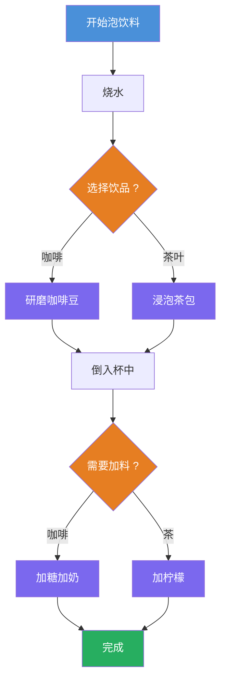
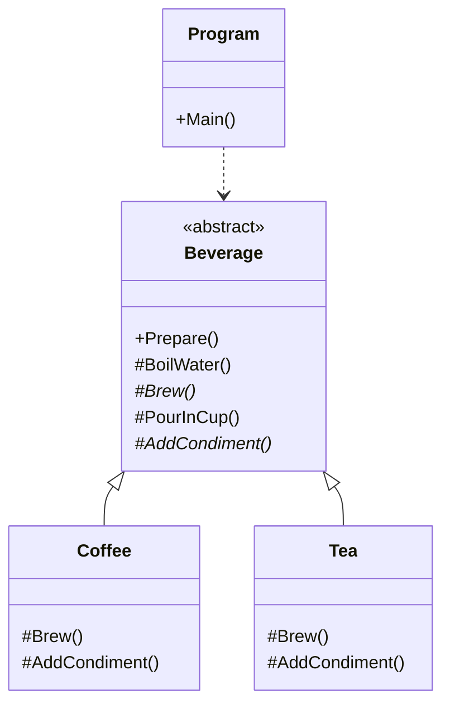

# 模板方法模式教程

[TOC]

## 一、📖 概述

模板方法模式是**行为型设计模式**，在一个方法中定义算法的**骨架**，将一些步骤**延迟到子类实现**。

核心思想：父类固定算法流程，子类只定制可变的步骤。在不改变算法结构的前提下复用公共逻辑。

### 核心特性

- **流程固定**：模板方法在父类中定义完整的执行顺序

- **步骤延迟**：可变步骤声明为抽象方法，由子类实现

- **符合开闭原则**：新增子类无需修改已有算法骨架

- **消除重复**：公共逻辑上移到父类，子类只关注差异部分

<br/>

## 二、📐 结构图解

### 2.1 整体流程

以泡咖啡和泡茶为例，两者共享"烧水→冲泡→倒杯→加料"的骨架：



### 2.2 类关系



<br/>

## 三、💻 代码实现

以泡咖啡/泡茶为例，父类 `Beverage` 定义模板方法，子类实现可变步骤。

### 3.1 抽象父类（模板方法）

```csharp
public abstract class Beverage
{
    // 模板方法：定义算法骨架，不允许子类重写
    public void Prepare()
    {
        BoilWater();       // 固定步骤：烧水
        Brew();            // 可变步骤：子类实现
        PourInCup();       // 固定步骤：倒入杯中
        AddCondiment();    // 可变步骤：子类实现
    }

    protected void BoilWater()
        => Console.WriteLine("烧开水");

    protected void PourInCup()
        => Console.WriteLine("倒入杯中");

    protected abstract void Brew();
    protected abstract void AddCondiment();
}
```

### 3.2 具体子类

```csharp
public class Coffee : Beverage
{
    protected override void Brew()
        => Console.WriteLine("研磨咖啡豆并冲泡");

    protected override void AddCondiment()
        => Console.WriteLine("加入糖和牛奶");
}

public class Tea : Beverage
{
    protected override void Brew()
        => Console.WriteLine("浸泡茶包");

    protected override void AddCondiment()
        => Console.WriteLine("加入柠檬片");
}
```

### 3.3 客户端调用

```csharp
public class Program
{
    public static void Main()
    {
        Beverage coffee = new Coffee();
        coffee.Prepare();

        Console.WriteLine("---");

        Beverage tea = new Tea();
        tea.Prepare();
    }
}
```

**运行结果**：
```
烧开水
研磨咖啡豆并冲泡
倒入杯中
加入糖和牛奶
---
烧开水
浸泡茶包
倒入杯中
加入柠檬片
```

<br/>

## 四、🔍 核心解析

### 4.1 模板方法

`Prepare()` 在父类中定义了完整的算法骨架，声明为 `public` 且不允许子类重写。它保证了无论哪个子类执行，流程顺序始终一致。

### 4.2 固定步骤 vs 可变步骤

`BoilWater()` 和 `PourInCup()` 是所有饮品共有的操作，直接在父类实现。`Brew()` 和 `AddCondiment()` 是差异化的步骤，声明为抽象方法交给子类。

### 4.3 控制反转

模板方法模式实现了"向上传调用"——父类调用子类的抽象方法，而非子类调用父类。父类控制整体节奏，子类只负责填充细节。

<br/>

## 五、🎯 应用场景

### 5.1 适用场景

- 多个类有相似的算法流程，仅部分步骤不同

- 需要统一算法骨架，但允许子类定制具体行为

- 想在不修改已有代码的前提下扩展算法的某些步骤

### 5.2 实际案例

- **.NET Stream**：`Stream` 基类定义读写骨架，子类实现具体I/O

- **ASP.NET Middleware**：`Middleware` 基类定义 `Invoke` 流程

- **单元测试框架**：`TestBase` 定义 `Setup→Run→Verify` 流程，子类实现具体测试

<br/>

## 六、⚖️ 优缺点分析

### 6.1 优点

- **代码复用**：公共逻辑集中在父类，避免重复

- **流程可控**：父类掌控算法骨架，子类无法改变执行顺序

- **扩展灵活**：新增子类即可扩展新行为，无需改动父类

### 6.2 缺点

- **继承强耦合**：子类与父类绑定紧密，修改模板方法影响所有子类

- **类数量增加**：每个变体都需要一个子类实现

- **违反里氏替换**：父类增加抽象方法时，所有已有子类都需要修改

<br/>

## 七、📝 总结

- **核心思想**：固定算法骨架，延迟可变步骤到子类

- **关键角色**：抽象父类（定义模板方法）、具体子类（实现可变步骤）

- **适用场景**：多个类有相似流程但部分步骤不同

- **注意事项**：模板方法数量不宜过多，避免类层次过深导致维护困难
