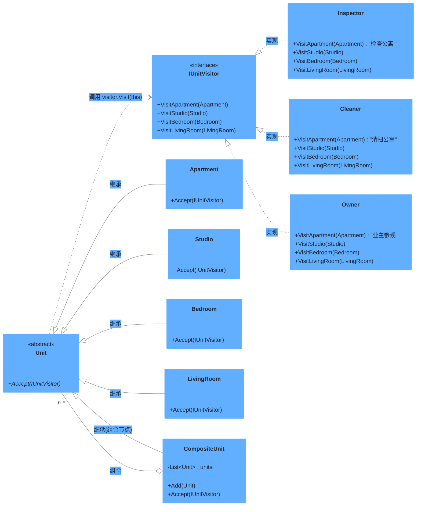

# 访问者模式（Visitor Pattern）

> **核心思想**：**将算法与对象结构分离**。在不修改现有类的前提下，为其增加新的操作——通过"访问者"在运行时对结构中每个元素执行相应操作（典型实现为**双重分派**）。

## 解决什么问题

房间（卧室/客厅/公寓）需要被不同角色"访问"（检查员/清洁工/业主），若给每个房间类都加一套访问逻辑，类会膨胀且难以扩展新角色。访问者模式让元素类只暴露 `Accept(IUnitVisitor)`，具体操作集中在访问者中；新增一种访问者即可为所有房间增加一种全新操作，而**无需改动元素类**，符合**开闭原则**。

## 主要参与者

| 角色 | 本示例类 | 职责 |
| --- | --- | --- |
| 元素 Element | `Unit` | 抽象元素，定义 `Accept(IUnitVisitor)` |
| 具体元素 | `Apartment` / `Studio` / `Bedroom` / `LivingRoom` | 在 `Accept` 中调用 `visitor.Visit(this)`（第一重分派） |
| 访问者 Visitor | `IUnitVisitor` | 为每种具体元素声明一个 `Visit` 重载 |
| 具体访问者 | `Inspector` / `Cleaner` / `Owner` | 实现针对各房间的操作（第二重分派） |
| 对象结构 | `CompositeUnit` | 组合并遍历子单元 |

## 类图



## 源码结构

目录下源码文件与职责对应：

- **Unit.cs**：抽象元素，声明 `Accept(IUnitVisitor visitor)`。
- **Apartment.cs / Studio.cs / Bedroom.cs / LivingRoom.cs**：具体元素，`Accept` 中调用 `visitor.VisitApartment(this)` 等——运行时由实际元素类型决定调用哪个重载（**第一重分派**）。
- **IUnitVisitor.cs**：访问者接口，为每个具体元素类型声明独立的 `Visit` 重载。
- **Inspector.cs / Cleaner.cs / Owner.cs**：具体访问者，分别针对每种房间实现"检查 / 清扫 / 参观"操作（**第二重分派**）。
- **CompositeUnit.cs**：组合结构，`Accept` 时先访问自身子节点，支持对整棵树应用访问者。
- **Program.cs**：构建房间树，依次让 `Inspector` / `Cleaner` / `Owner` 访问，观察每种访问者在不修改房间类的前提下为全部房间添加了独立操作。

```csharp
// Bedroom.Accept() 核心代码
public override void Accept(IUnitVisitor visitor) {
    visitor.VisitBedroom(this);   // 双重分派：元素类型 → 访问者重载
}
```
