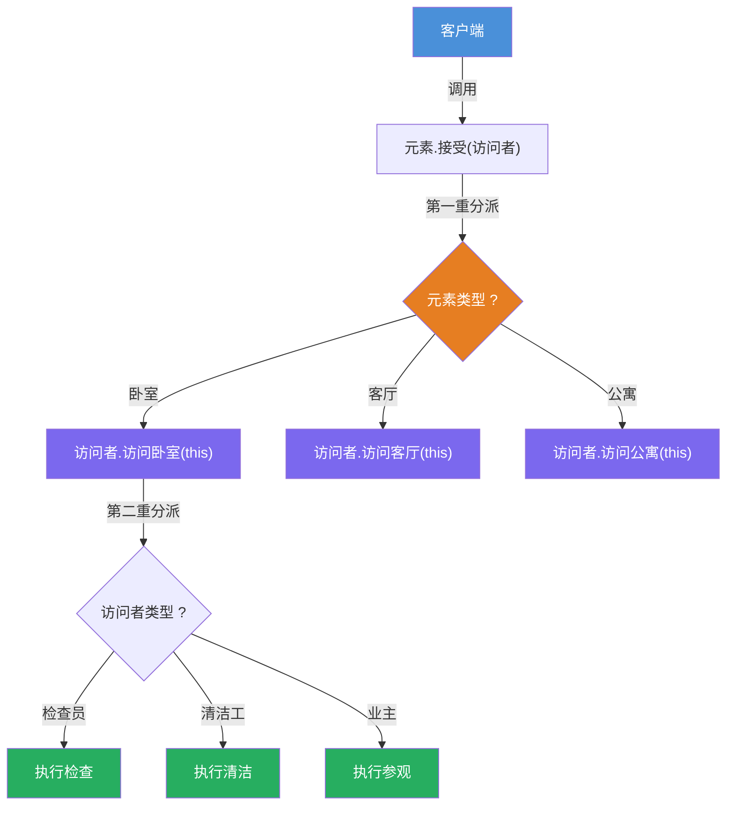
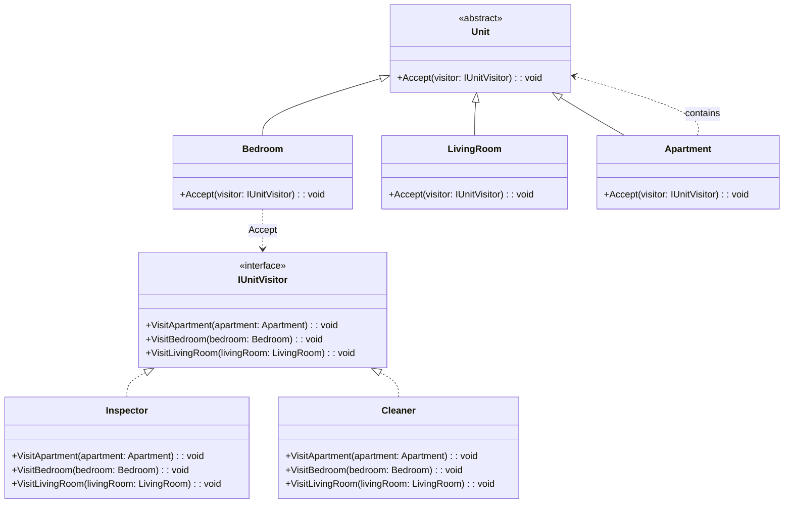

# 访问者模式（Visitor Pattern）教程

[TOC]

## 一、📖 概述

访问者模式是**行为型设计模式**，在**不修改现有类的前提下**为其增加新的操作，通过"访问者"在运行时对结构中每个元素执行相应操作。

核心思想：将算法与对象结构分离，元素类只暴露 `Accept` 方法，具体操作集中在访问者中。典型实现为**双重分派**——元素接受访问者时调用访问者的对应重载方法。

### 核心特性

- **开闭原则**：新增访问者无需修改元素类

- **关注点分离**：每种操作封装在独立的访问者中

- **双重分派**：运行时根据元素类型和访问者类型共同决定执行逻辑

- **结构稳定**：适用于元素类型不常变化，但操作频繁增加的场景

<br/>

## 二、📐 结构图解

### 2.1 整体流程



### 2.2 类关系



### 2.3 关键角色

| 角色                               | 说明                                               |
| ---------------------------------- | -------------------------------------------------- |
| **元素接口（Element）**            | 声明 `Accept(visitor)` 方法，接受访问者            |
| **具体元素（Concrete Element）**   | 实现 `Accept`，在内部调用 `visitor.VisitXxx(this)` |
| **访问者接口（Visitor）**          | 为每种元素类型声明一个 `Visit` 重载方法            |
| **具体访问者（Concrete Visitor）** | 实现特定操作逻辑，每个 `Visit` 方法处理一种元素    |

<br/>

## 三、💻 代码实现

以房间检查/清洁/参观为例：卧室、客厅、公寓等房间类型接受不同角色的访问。

### 3.1 元素接口与具体元素

```csharp
// 抽象元素
public abstract class Unit
{
    public abstract void Accept(IUnitVisitor visitor);
}

// 具体元素：卧室
public class Bedroom : Unit
{
    public override void Accept(IUnitVisitor visitor)
    {
        visitor.VisitBedroom(this);  // 第一重分派
    }
}

// 具体元素：公寓（组合元素）
public class Apartment : Unit
{
    private readonly List<Unit> _children = new();

    public void Add(Unit unit) => _children.Add(unit);

    public override void Accept(IUnitVisitor visitor)
    {
        visitor.VisitApartment(this);
        foreach (var child in _children)
            child.Accept(visitor);  // 遍历子元素
    }
}
```

### 3.2 访问者接口与具体访问者

```csharp
// 访问者接口：为每种元素声明一个 Visit 重载
public interface IUnitVisitor
{
    void VisitBedroom(Bedroom bedroom);
    void VisitLivingRoom(LivingRoom livingRoom);
    void VisitApartment(Apartment apartment);
}

// 具体访问者：检查员
public class Inspector : IUnitVisitor
{
    public void VisitBedroom(Bedroom bedroom)
        => Console.WriteLine("检查卧室的安全设施");

    public void VisitLivingRoom(LivingRoom livingRoom)
        => Console.WriteLine("检查客厅的消防通道");

    public void VisitApartment(Apartment apartment)
        => Console.WriteLine("检查公寓的整体结构");
}

// 具体访问者：清洁工
public class Cleaner : IUnitVisitor
{
    public void VisitBedroom(Bedroom bedroom)
        => Console.WriteLine("清洁卧室地面");

    public void VisitLivingRoom(LivingRoom livingRoom)
        => Console.WriteLine("清洁客厅窗户");

    public void VisitApartment(Apartment apartment)
        => Console.WriteLine("清洁公寓公共区域");
}
```

### 3.3 客户端使用

```csharp
public class Program
{
    public static void Main()
    {
        // 构建房间树
        var apartment = new Apartment();
        apartment.Add(new Bedroom());
        apartment.Add(new LivingRoom());

        // 不同访问者访问同一结构，产生不同操作
        apartment.Accept(new Inspector());
        apartment.Accept(new Cleaner());
    }
}
```

**运行结果**：

```
检查公寓的整体结构
检查卧室的安全设施
检查客厅的消防通道
清洁公寓公共区域
清洁卧室地面
清洁客厅窗户
```

<br/>

## 四、🔍 核心解析

### 4.1 双重分派

双重分派是访问者模式的核心机制：元素的 `Accept` 方法接收访问者后，调用 `visitor.VisitXxx(this)`，将自身作为参数传回。此时方法的执行路径由**元素类型**和**访问者类型**共同决定。

```csharp
// 第一重：元素类型决定调用哪个 Visit 重载
visitor.VisitBedroom(this);
// 第二重：访问者类型决定具体执行逻辑
```

### 4.2 开闭原则

新增一种操作（如"消毒"）只需创建新的访问者类，无需修改任何房间类。新增房间类型则需修改访问者接口和所有实现——这正是访问者模式的代价。

### 4.3 组合结构遍历

`CompositeUnit` / `Apartment` 在 `Accept` 中先访问自身，再递归遍历子元素，使访问者能对整棵对象树执行操作。

<br/>

## 五、🎯 应用场景

### 5.1 适用场景

- 对象结构稳定，但需要对其执行多种不同操作

- 需要在不修改已有类的前提下增加新操作

- 操作涉及多个不同类型，且各类型的处理逻辑不同

### 5.2 实际案例

- **编译器**：AST节点类型固定，但需要执行类型检查、代码生成、优化等多种操作

- **文档处理**：文档元素（段落、图片、表格）接受渲染、导出、统计等不同访问者

- **UI事件处理**：控件树接受鼠标点击、键盘输入、无障碍访问等不同访问者

<br/>

## 六、⚖️ 优缺点分析

### 6.1 优点

- **符合开闭原则**：新增操作无需修改元素类

- **关注点分离**：每种操作封装在独立访问者中，职责清晰

- **可以访问组合对象内部**：访问者可访问元素的内部状态和结构

### 6.2 缺点

- **扩展元素困难**：新增元素类型需修改所有访问者接口和实现

- **破坏封装**：访问者可能需要访问元素内部细节，暴露元素私有成员

- **双重分派开销**：运行时存在额外的方法调用开销

<br/>

## 七、📝 总结

- **核心思想**：将算法与对象结构分离，通过双重分派实现运行时多态

- **关键角色**：抽象元素、具体元素、访问者接口、具体访问者

- **适用场景**：元素类型稳定但操作频繁增加的场景

- **注意事项**：新增元素类型成本高，设计时需评估元素类型的稳定性

---

## 八、🔬 双重分派机制详解

双重分派（Double Dispatch）是访问者模式的核心机制，解决了一个关键问题：**如何让执行逻辑同时取决于元素类型和访问者类型**。

### 8.1 单分派 vs 双分派

| 机制       | 决定因素                      | C# 实现方式                  | 局限               |
| ---------- | ----------------------------- | ---------------------------- | ------------------ |
| **单分派** | 仅由接收者类型决定            | 普通虚方法 `bedroom.Clean()` | 无法区分"谁来操作" |
| **双分派** | 接收者类型 + 参数类型共同决定 | `Accept` + 方法重载          | 需要两层间接调用   |

### 8.2 执行流程拆解

以 `apartment.Accept(new Inspector())` 为例：

```
第一重分派（元素类型决定）：
  apartment.Accept(visitor)
    → visitor.VisitApartment(this)   ← 选择 Visit 重载（Bedroom/LivingRoom/Apartment）

第二重分派（访问者类型决定）：
  visitor.VisitApartment(apartment)
    → Inspector 的具体实现            ← 选择访问者的实际逻辑（检查/清洁/参观）
```

### 8.3 为什么需要两重？

```csharp
// 如果只用一重分派（只有元素类型）：
public class Bedroom
{
    public void Accept(Inspector inspector) { ... }  // 为每个访问者写重载 → 类爆炸
    public void Accept(Cleaner cleaner) { ... }
    public void Accept(HomeOwner owner) { ... }
}

// 访问者模式的解法（双重分派）：
public class Bedroom
{
    public override void Accept(IUnitVisitor visitor)
        => visitor.VisitBedroom(this);  // 统一入口，由接口分派到具体访问者
}
```

**第一重**让元素选择正确的 `Visit` 重载（利用 C# 的**静态类型分派**，`this` 的编译时类型决定调用哪个重载）；**第二重**让访问者在 `VisitXxx` 方法中根据自身类型执行不同逻辑（利用 C# 的**运行时多态**，虚方法分派到 `Inspector` 或 `Cleaner`）。

两重分派组合后，**无需为每对（元素 × 访问者）编写组合类**，新增访问者只需实现 `IUnitVisitor` 接口即可。
