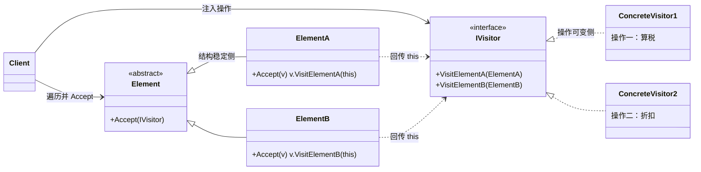
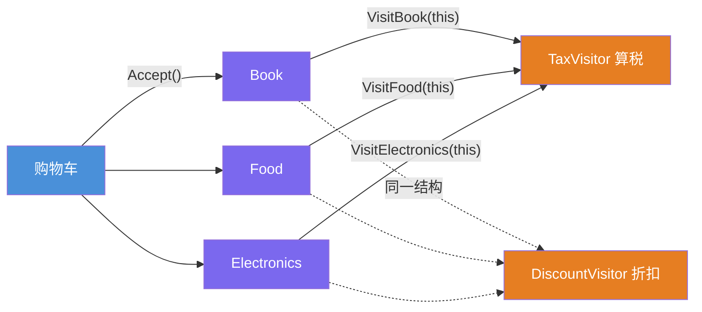
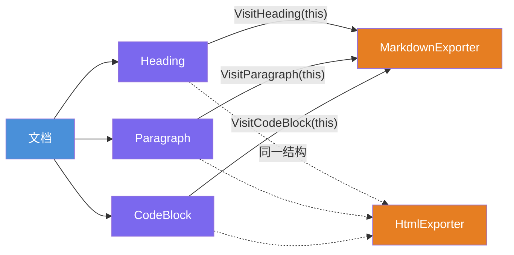

# 访问者模式（Visitor Pattern）

[TOC]

## 一、📖 概述

访问者是**行为型设计模式**，表示一个作用于某对象结构中各元素的操作，**使你可以在不改变各元素类的前提下定义作用于这些元素的新操作**。

核心思想：**双重分派**——`element.Accept(visitor)` 是第一次分派（由元素类型决定走哪个 Accept），Accept 内部回传 `visitor.VisitXxx(this)` 是第二次分派（由访问者类型决定具体逻辑）。两轴相乘，"元素类型 × 操作类型"的每一种组合都有独立落点，新增操作只需新增访问者。适用前提：**元素结构稳定，操作频繁扩展**。

<br/>

## 二、🧩 模式解析

### 2.1 类关系图



| 关键角色 | 说明 | 购物示例 |
| --- | --- | --- |
| **元素接口（Element）** | 声明 `Accept(visitor)` | `Item` |
| **具体元素（Concrete Element）** | Accept 中回传 `this` 给对应 Visit 方法 | `Book`/`Food`/`Electronics` |
| **访问者接口（Visitor）** | 每种元素一个 Visit 方法（重载） | `IShoppingVisitor` |
| **具体访问者（Concrete Visitor）** | 一种操作的全套实现 | `TaxVisitor`/`DiscountVisitor` |

### 2.2 核心代码

```csharp
// 访问者：每种元素一个 Visit 方法
interface IVisitor
{
    void VisitElementA(ElementA elementA);
    void VisitElementB(ElementB elementB);
}

// 元素：Accept 回传 this —— 双分派的关键
abstract class Element
{
    public abstract void Accept(IVisitor visitor);
}

class ElementA : Element
{
    public override void Accept(IVisitor visitor) => visitor.VisitElementA(this);
}

// 客户端：遍历结构，注入不同访问者 = 不同操作
foreach (var element in structure)
    element.Accept(new ConcreteVisitor1());     // 操作一
foreach (var element in structure)
    element.Accept(new ConcreteVisitor2());     // 操作二：元素类零改动
```

> 协作方式：客户端遍历元素结构，对每个元素调用 `Accept(visitor)`；元素在 Accept 里把自己回传给访问者的对应 `VisitXxx`——"元素报身份，访问者出逻辑"，两轴分派定位到具体操作。

### 2.3 关键解析

**为什么需要双重分派？** C# 单分派只看调用者的编译类型：

```csharp
// 若不用访问者，直接 visitor.Process(item)：
// item 静态类型是 Item，无法按 Book/Food/Electronics 分发
// （C# 重载按编译期类型选择，不按运行期）

// 双分派：先由 item 的运行期类型进 Accept，再回传 this 给 VisitXxx
item.Accept(visitor);   // ① item 运行期类型 → Book.Accept
                        // ② Book.Accept → visitor.VisitBook(this)
```

| 扩展方向 | 代价 | 说明 |
| --- | --- | --- |
| **新增操作**（新访问者） | ✅ 加一个类 | 模式的主打能力 |
| **新增元素类型**（新商品类别） | ❌ 所有访问者接口 + 实现都要加方法 | 结构稳定是使用前提 |

- **BCL/框架中的身影**：Roslyn 语法树（`CSharpSyntaxVisitor`：SyntaxNode.Accept + VisitXxx）、`ExpressionVisitor`（LINQ 表达式树改写）——都是"结构稳定、操作多变"的典型
- **访问者 vs 策略**：策略是"一个上下文换算法"，访问者是"一组不同类型元素批量过一遍算法"
- **常与组合模式连用**：组合树提供遍历骨架（`Accept` 递归子节点），访问者提供对各类节点的操作——Roslyn 表达式树正是如此

<br/>

## 三、💻 代码示例

### 3.1 经典场景：购物车计税与折扣

> 场景：同一批商品跑两种访问者——图书 9%/食品免税/数码 13% 的**税费计算**，与图书满 50 减 10/数码 95 折的**会员折扣**，商品类零改动。



| 角色 | 文件 |
| --- | --- |
| 访问者接口 | [`Shopping/IShoppingVisitor.cs`](Shopping/IShoppingVisitor.cs) |
| 具体访问者 | [`Shopping/TaxVisitor.cs`](Shopping/TaxVisitor.cs)、[`DiscountVisitor.cs`](Shopping/DiscountVisitor.cs) |
| 抽象元素 | [`Shopping/Item.cs`](Shopping/Item.cs) |
| 具体元素 | [`Shopping/Book.cs`](Shopping/Book.cs)、[`Food.cs`](Shopping/Food.cs)、[`Electronics.cs`](Shopping/Electronics.cs) |
| 客户端 | [`Program.cs`](Program.cs) |

### 3.2 软件项目：文档多格式导出

> 场景：文档结构（标题/段落/代码块）稳定，导出格式（Markdown/HTML）多变——新增 PDF 导出器只加一个类，与 Roslyn 语法树访问者同构。



| 角色 | 文件 |
| --- | --- |
| 访问者接口 | [`Docs/IExporter.cs`](Docs/IExporter.cs) |
| 具体访问者 | [`Docs/MarkdownExporter.cs`](Docs/MarkdownExporter.cs)、[`HtmlExporter.cs`](Docs/HtmlExporter.cs) |
| 抽象元素 | [`Docs/DocElement.cs`](Docs/DocElement.cs) |
| 具体元素 | [`Docs/Heading.cs`](Docs/Heading.cs)、[`Paragraph.cs`](Docs/Paragraph.cs)、[`CodeBlock.cs`](Docs/CodeBlock.cs) |
| 客户端 | [`Program.cs`](Program.cs) |

### 3.3 运行结果

```bash
========== 访问者模式 (Visitor Pattern) ==========
不改动元素类，为对象结构新增操作

--- 经典场景: 购物车计税与折扣 ---
>> 同一批商品，跑两种访问者（算税 / 算折扣）：

>> 第一种操作：税费计算访问者
[税费] 《设计模式：可复用面向对象软件的基础》¥89.00 × 9% = ¥8.01
[税费] 有机菠菜 500g ¥12.50 × 0% = 免税（初级农产品）
[税费] 机械键盘 ¥499.00 × 13% = ¥64.87
[合计] 税费总计 ¥72.88

>> 第二种操作：会员折扣访问者（商品类零改动）
[折扣] 《设计模式：可复用面向对象软件的基础》¥89.00 → ¥79.00（图书满50减10）
[折扣] 有机菠菜 500g ¥12.50（食品不参与折扣）
[折扣] 机械键盘 ¥499.00 → ¥474.05（数码95折）
[合计] 折后应付 ¥565.55

--- 软件项目: 文档多格式导出 ---
>> 同一份文档，导出两种格式：

>> Markdown 导出器：
# 访问者模式
在不改变元素类的前提下定义新操作。
```csharp
item.Accept(visitor);
```

>> HTML 导出器（新增格式只加一个类）：
<h1>访问者模式</h1>
<p>在不改变元素类的前提下定义新操作。</p>
<pre><code>item.Accept(visitor);</code></pre>
```

<br/>

## 四、📝 小结

- **核心思想**：双重分派让"元素类型 × 操作类型"各自定位，新增操作只加访问者类

- **两个示例**：购物车展示同一结构的两种业务操作（税/折扣），文档导出展示 Roslyn 同构的"结构稳定、格式多变"

- **注意事项**：元素类型会频繁增加时别用（每个访问者都要跟着改）；访问者需要读元素的内部细节，可能破坏封装——Roslyn 愿意开放正是为了换扩展性
