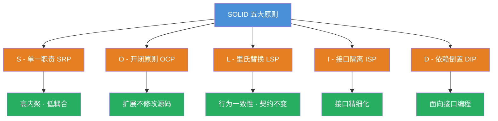
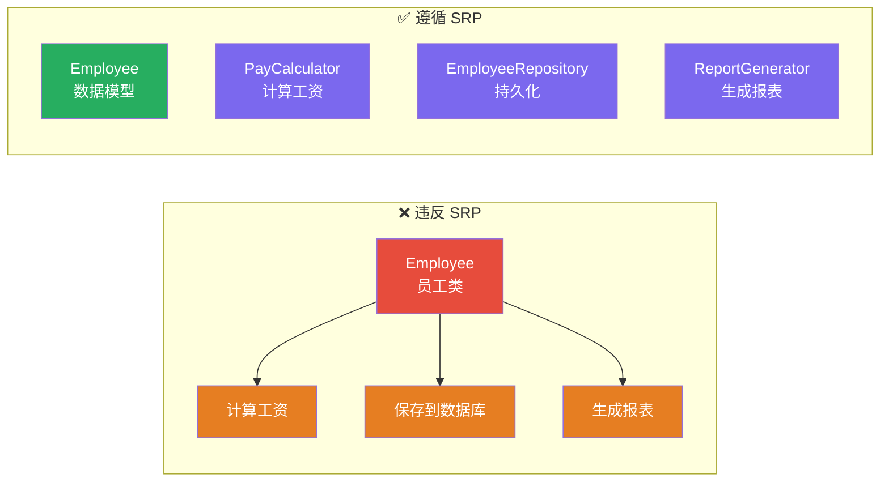
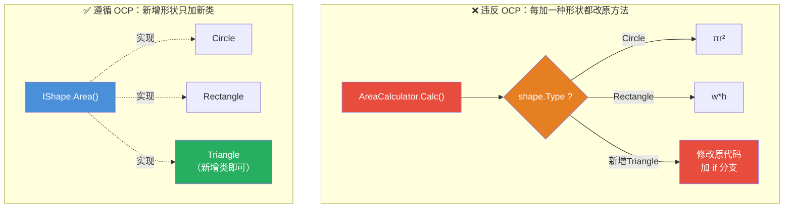
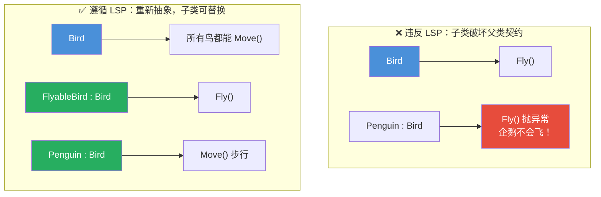
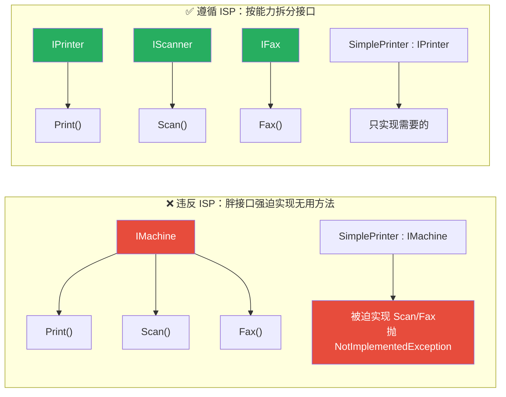
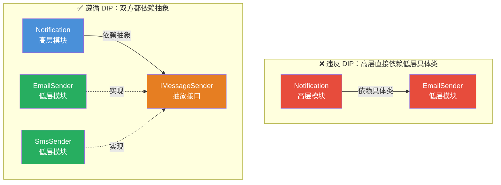
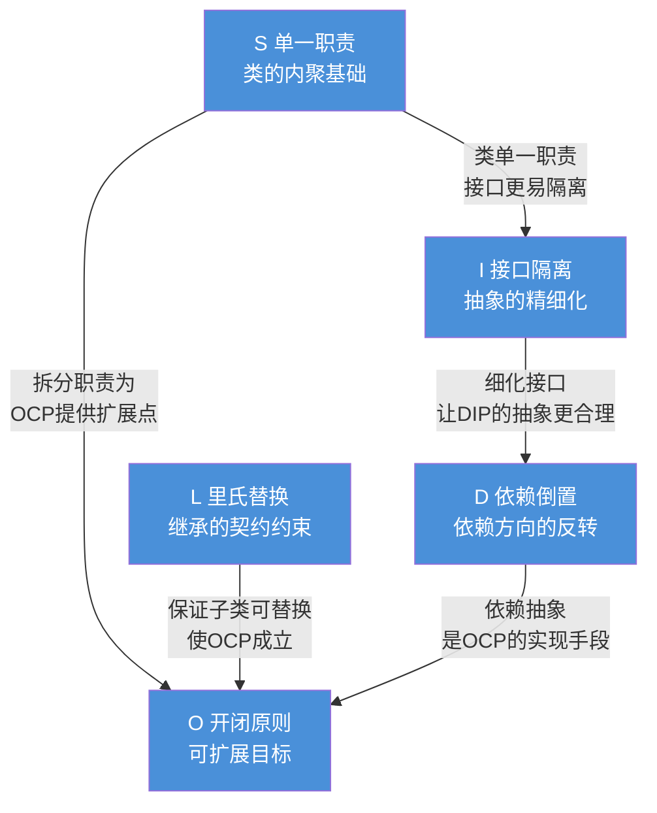

# SOLID 五大设计原则

[TOC]

## 一、📖 概述

SOLID 是面向对象设计的五大基本原则的首字母缩写，由 Robert C. Martin（Uncle Bob）在《Agile Software Development, Principles, Patterns, and Practices》中提出。它们是构建**可维护、可扩展、可复用**软件的基石。

SOLID 不是具体的设计模式，而是设计模式背后的**指导思想**——本仓库中的 23 种 GoF 模式，大多是对这些原则的具体应用。

### 核心价值

- **可维护性**：修改需求时影响范围可控

- **可扩展性**：新增功能不破坏既有结构

- **可复用性**：类与模块可在不同上下文中重用

- **可测试性**：依赖清晰，易于单元测试

### 五原则速览

| 缩写  | 原则                            | 中文         | 一句话核心                       |
| ----- | ------------------------------- | ------------ | -------------------------------- |
| **S** | Single Responsibility Principle | 单一职责原则 | 一个类只应有一个引起变化的原因   |
| **O** | Open/Closed Principle           | 开闭原则     | 对扩展开放，对修改关闭           |
| **L** | Liskov Substitution Principle   | 里氏替换原则 | 子类必须能替换父类               |
| **I** | Interface Segregation Principle | 接口隔离原则 | 接口应小而专，不强迫实现无用方法 |
| **D** | Dependency Inversion Principle  | 依赖倒置原则 | 依赖抽象，不依赖具体             |

<br/>

## 二、🌐 总览图解



<br/>

## 三、🔹 S - 单一职责原则（SRP）

**单一职责原则**：一个类应该只有一个引起它变化的原因，即**只有一个职责**。

### 3.1 核心思想

如果一个类承担多个职责，当其中任一职责变化时，都会修改这个类，导致其他职责受到影响。职责越多，类的稳定性越差。



### 3.2 违反示例

一个 `Employee` 类同时承担数据存储、工资计算、报表生成三种职责：

```csharp
// ❌ 一个类承担多种职责，任一变化都会影响其他功能
public class Employee
{
    public string Name { get; set; }
    public decimal Salary { get; set; }

    // 职责1：计算工资
    public decimal CalculatePay() => Salary * 1.1m;

    // 职责2：持久化
    public void SaveToDatabase() { /* 写入数据库 */ }

    // 职责3：生成报表
    public string GenerateReport() => $"员工：{Name}，工资：{Salary}";
}
```

### 3.3 正确示例

将不同职责拆分为独立的类，各自独立变化：

```csharp
// ✅ 数据模型：只承载员工数据
public class Employee
{
    public string Name { get; set; }
    public decimal Salary { get; set; }
}

// ✅ 职责1：工资计算
public class PayCalculator
{
    public decimal Calculate(Employee employee) => employee.Salary * 1.1m;
}

// ✅ 职责2：持久化
public class EmployeeRepository
{
    public void Save(Employee employee) { /* 写入数据库 */ }
}

// ✅ 职责3：报表生成
public class ReportGenerator
{
    public string Generate(Employee employee) => $"员工：{employee.Name}，工资：{employee.Salary}";
}
```

**关键收益**：修改报表格式不会影响工资计算逻辑，反之亦然。

<br/>

## 四、🔸 O - 开闭原则（OCP）

**开闭原则**：软件实体应对扩展开放、对修改关闭——**通过扩展新增功能，而非改动既有代码**。

### 4.1 核心思想

需求变化时，优先通过新增类或方法实现新行为，而不是修改已稳定运行的代码。这降低了回归风险，是**可扩展架构**的根本。



### 4.2 违反示例

通过 `if-else` 判断类型，每新增一种形状就要改动原方法：

```csharp
// ❌ 每新增一种形状都要改这里
public class AreaCalculator
{
    public double Calc(object shape)
    {
        if (shape is Circle c) return Math.PI * c.Radius * c.Radius;
        if (shape is Rectangle r) return r.Width * r.Height;
        // 新增三角形还得改这里
        throw new ArgumentException("未知形状");
    }
}
```

### 4.3 正确示例

定义抽象接口，新增形状只需新增实现类，**原有代码零修改**：

```csharp
// ✅ 抽象接口稳定不变
public interface IShape
{
    double Area();
}

public class Circle : IShape
{
    public double Radius { get; set; }
    public double Area() => Math.PI * Radius * Radius;
}

public class Rectangle : IShape
{
    public double Width { get; set; }
    public double Height { get; set; }
    public double Area() => Width * Height;
}

// ✅ 新增三角形：只加新类，不动既有代码
public class Triangle : IShape
{
    public double Base { get; set; }
    public double Height { get; set; }
    public double Area() => 0.5 * Base * Height;
}
```

**关键收益**：`AreaCalculator` 可改为遍历 `IShape.Area()`，新增形状无需触碰它。

<br/>

## 五、🔹 L - 里氏替换原则（LSP）

**里氏替换原则**：所有引用父类的地方必须能透明地使用其子类对象，且**程序行为不变**。

### 5.1 核心思想

子类不能违反父类的契约——不能加强前置条件、不能削弱后置条件、不能抛出父类不期望的异常。"Is-A" 关系必须从**行为**层面成立，而不仅是类型层面。



### 5.2 违反示例

经典的"正方形继承长方形"问题——子类破坏了父类 `Width != Height` 的隐含契约：

```csharp
// ❌ 父类 Rectangle 假设 Width 和 Height 可独立变化
public class Rectangle
{
    public virtual int Width { get; set; }
    public virtual int Height { get; set; }
    public int Area() => Width * Height;
}

// ❌ 子类 Square 强制两者相等，违反父类契约
public class Square : Rectangle
{
    public override int Width
    {
        set { base.Width = base.Height = value; }  // 修改一个同步改另一个
    }
    public override int Height
    {
        set { base.Width = base.Height = value; }
    }
}

// 客户端代码
public void Test(Rectangle r)
{
    r.Width = 4;
    r.Height = 5;
    // 预期 area == 20，若 r 是 Square 则 == 25 —— 行为被破坏
    Debug.Assert(r.Area() == 20);  // 💥 断言失败
}
```

### 5.3 正确示例

不要让"正方形"继承"长方形"——它们不是 Is-A 关系。应引入共同抽象：

```csharp
// ✅ 引入更基础的抽象 Shape
public abstract class Shape
{
    public abstract int Area();
}

public class Rectangle : Shape
{
    public int Width { get; set; }
    public int Height { get; set; }
    public override int Area() => Width * Height;
}

public class Square : Shape
{
    public int Side { get; set; }
    public override int Area() => Side * Side;
}
```

**关键收益**：客户端依赖 `Shape` 抽象，任意子类替换都不会破坏行为预期。

<br/>

## 六、🔸 I - 接口隔离原则（ISP）

**接口隔离原则**：客户端不应被迫依赖它不使用的方法——**接口应小而专**。

### 6.1 核心思想

臃肿接口（Fat Interface）会让实现类被迫提供无意义的方法。应将大接口按职责拆分为多个精细接口，客户端只依赖它真正需要的那个。



### 6.2 违反示例

一个"全能机器"接口，让简单打印机被迫实现扫描、传真：

```csharp
// ❌ 胖接口
public interface IMachine
{
    void Print(Document d);
    void Scan(Document d);
    void Fax(Document d);
}

// ❌ 简单打印机被迫实现不需要的 Scan / Fax
public class SimplePrinter : IMachine
{
    public void Print(Document d) { /* 真正实现 */ }
    public void Scan(Document d) => throw new NotImplementedException();
    public void Fax(Document d) => throw new NotImplementedException();
}
```

### 6.3 正确示例

按能力拆分为多个小接口，实现类各取所需：

```csharp
// ✅ 接口按能力拆分
public interface IPrinter
{
    void Print(Document d);
}

public interface IScanner
{
    void Scan(Document d);
}

public interface IFaxMachine
{
    void Fax(Document d);
}

// ✅ 简单打印机只实现需要的能力
public class SimplePrinter : IPrinter
{
    public void Print(Document d) { /* 真正实现 */ }
}

// ✅ 多功能一体机组合多个接口
public class MultiFunctionMachine : IPrinter, IScanner, IFaxMachine
{
    public void Print(Document d) { /* ... */ }
    public void Scan(Document d) { /* ... */ }
    public void Fax(Document d) { /* ... */ }
}
```

**关键收益**：客户端只依赖真正用到的接口，减少不必要的耦合和虚假实现。

<br/>

## 七、🔹 D - 依赖倒置原则（DIP）

**依赖倒置原则**：高层模块不应依赖低层模块，二者都应依赖**抽象**；抽象不应依赖细节，细节应依赖抽象。

### 7.1 核心思想

传统自上而下的依赖（高层 → 低层具体类）使得低层变化直接波及高层。DIP 通过引入抽象接口，让高层和低层都依赖这个抽象，从而**反转了依赖方向**。



### 7.2 违反示例

通知类直接 `new` 一个具体的邮件发送器，强耦合：

```csharp
// ❌ 高层直接依赖低层具体类
public class EmailSender
{
    public void Send(string message) { /* 发送邮件 */ }
}

public class Notification
{
    private readonly EmailSender _sender = new();  // 直接 new 具体类

    public void Notify(string message) => _sender.Send(message);
}
// 改用短信发送？必须修改 Notification —— 高层被低层变化绑架
```

### 7.3 正确示例

引入抽象接口，高层通过构造函数注入依赖，运行时灵活替换实现：

```csharp
// ✅ 抽象接口
public interface IMessageSender
{
    void Send(string message);
}

// ✅ 低层模块实现抽象
public class EmailSender : IMessageSender
{
    public void Send(string message) { /* 发送邮件 */ }
}

public class SmsSender : IMessageSender
{
    public void Send(string message) { /* 发送短信 */ }
}

// ✅ 高层模块依赖抽象，通过构造函数注入
public class Notification
{
    private readonly IMessageSender _sender;

    public Notification(IMessageSender sender) => _sender = sender;

    public void Notify(string message) => _sender.Send(message);
}

// 使用示例：运行时灵活切换实现
var emailNotifier = new Notification(new EmailSender());
var smsNotifier = new Notification(new SmsSender());
```

**关键收益**：新增 `PushSender` 无需修改 `Notification`，符合开闭原则，且易于单元测试（可注入 Mock）。

<br/>

## 八、🔗 原则间的关联

SOLID 五原则相互支撑，共同构成"面向抽象编程"的完整方法论：



**核心洞察**：

- **S** 让类高内聚，是其他一切的前提

- **L** 保证继承体系行为一致，使"面向父类编程"安全

- **I** 让抽象接口足够小、足够聚焦，避免"假依赖"

- **D** 反转依赖方向，让稳定的高层不再被易变的低层拖累

- **O** 是最终目标，S/L/I/D 都是支撑 O 的手段

<br/>

## 九、🧩 与 GoF 设计模式的对应

SOLID 原则并非空中楼阁——本仓库的 23 种 GoF 模式大多是这些原则的**具体落地**：

| 原则    | 对应设计模式                                                     | 如何体现                                                                  |
| ------- | ---------------------------------------------------------------- | ------------------------------------------------------------------------- |
| **SRP** | 外观模式（Facade）、代理模式（Proxy）                            | Facade 把多子系统协调的职责集中到一处；Proxy 把"访问控制"与"真实业务"分离 |
| **OCP** | 策略模式（Strategy）、状态模式（State）、命令模式（Command）     | 通过抽象接口注入新算法/新状态/新命令，不修改既有上下文                    |
| **LSP** | 模板方法模式（Template Method）、装饰器模式（Decorator）         | 子类重写钩子方法而不破坏父类骨架；装饰器透明替换被装饰对象                |
| **ISP** | 适配器模式（Adapter）、迭代器模式（Iterator）                    | 只暴露客户端需要的窄接口；`IEnumerable<T>` 仅提供遍历能力                 |
| **DIP** | 工厂模式（Factory Method）、观察者模式（Observer）、依赖注入容器 | 高层依赖 `IFactory`/`IObserver` 抽象，具体实现由子类或容器提供            |

> 💡 **实践建议**：学习设计模式时，先识别它体现了哪条 SOLID 原则，能更深刻理解"模式为何这样设计"，而非死记结构。

<br/>

## 十、📝 总结

- **核心思想**：SOLID 是面向对象设计的五大原则，目标是构建可维护、可扩展、可复用、可测试的软件

- **五原则要点**：
  - **S**：一个类只有一个变化原因
  - **O**：通过扩展而非修改实现变化
  - **L**：子类可无副作用替换父类
  - **I**：接口小而专，不强迫实现无用方法
  - **D**：高层与低层都依赖抽象

- **相互关系**：S 是内聚基础，L 是继承契约，I 细化抽象，D 反转依赖，O 是最终目标

- **与模式的关系**：GoF 设计模式是 SOLID 原则在具体场景下的模板化应用

- **使用建议**：原则是"方向"而非"教条"，应根据实际复杂度权衡——过度应用小项目会显得笨重，但忽略原则在大型系统必将累积技术债
