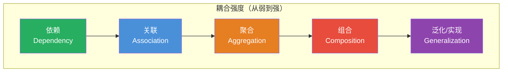
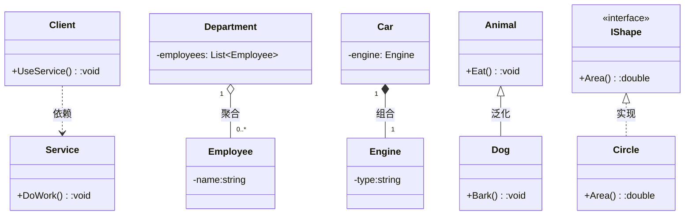
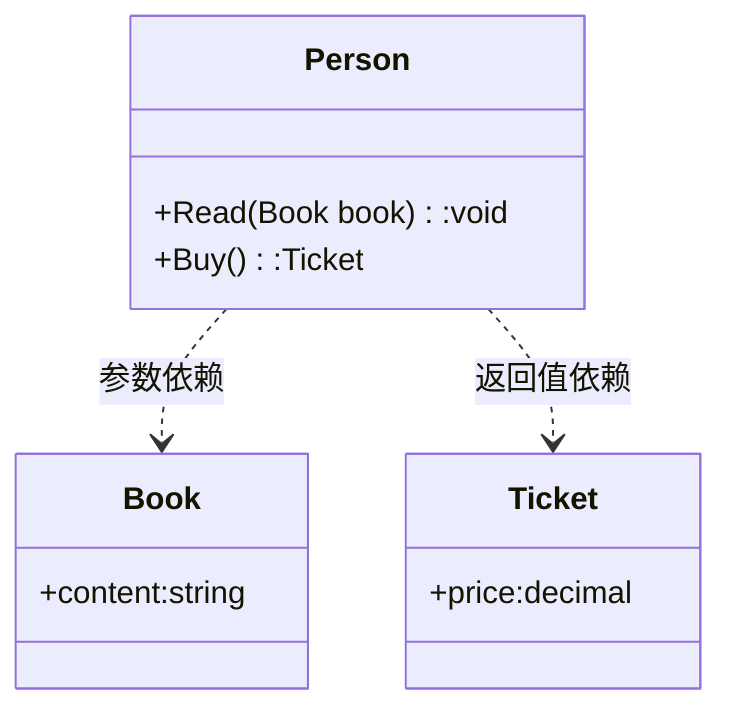
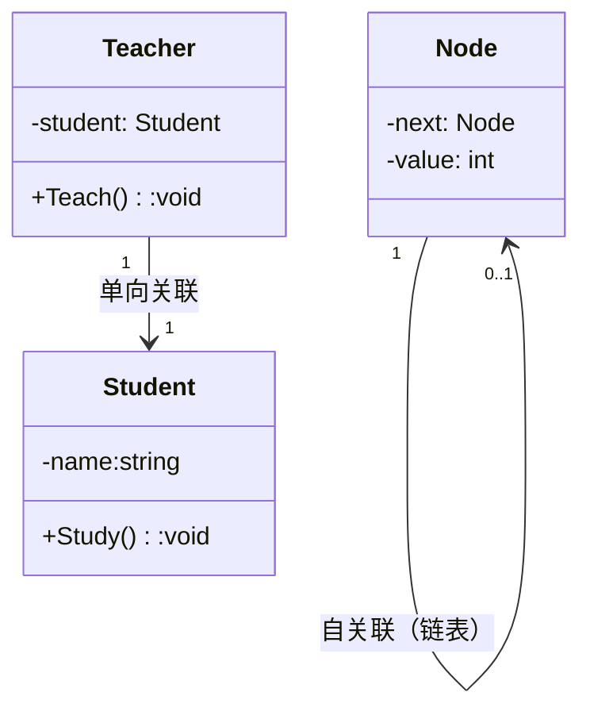
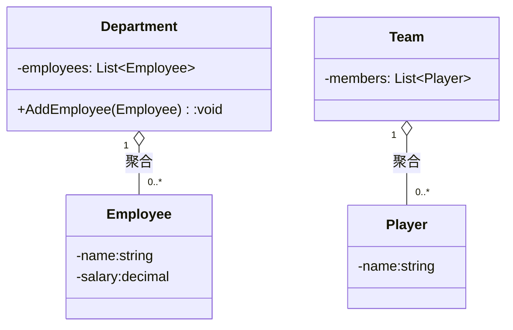
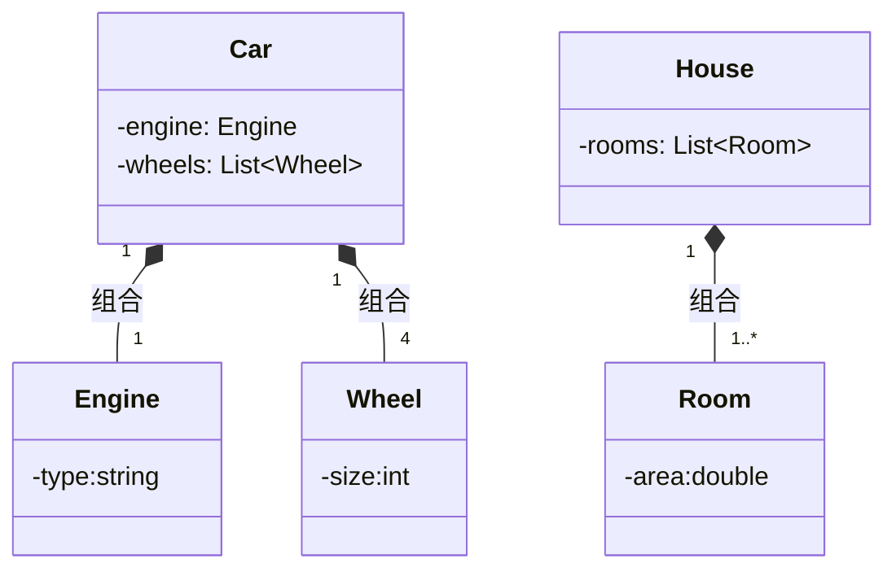
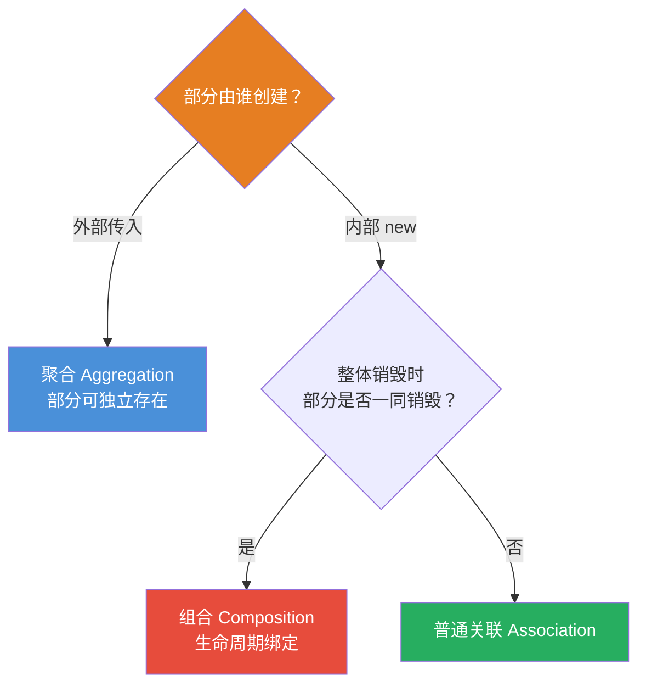
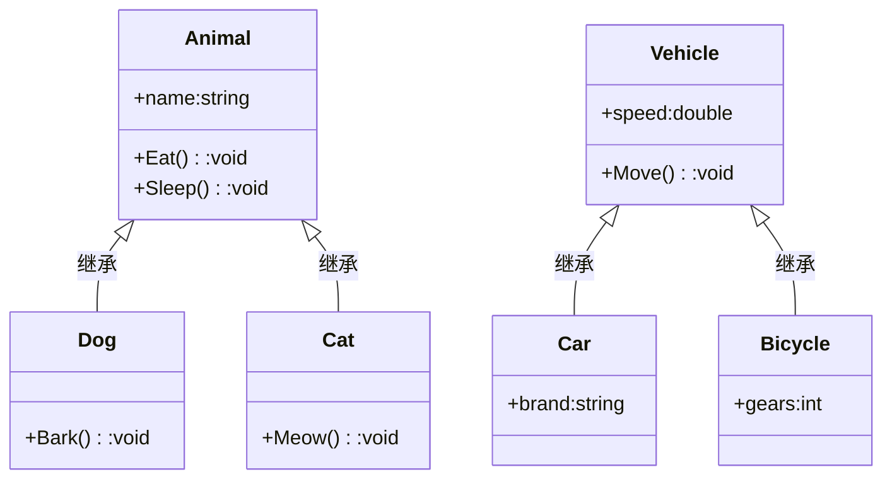
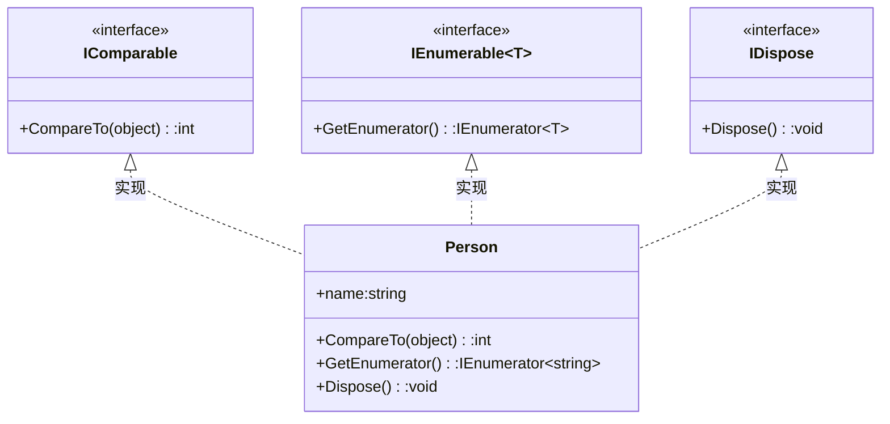
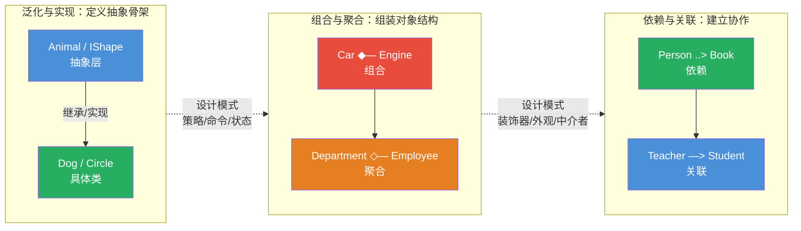

# UML 类图五大关系

[TOC]

## 一、📖 概述

UML 类图是面向对象设计中最常用的**静态结构图**，描述类与类之间的各种关系。读懂类图、画对类图，是学习设计模式和进行架构沟通的**基础语言**。

类图中的关系按**耦合强度**从弱到强分为五种：依赖、关联、聚合、组合、泛化/实现。理解它们的区别，才能在设计模式中准确表达意图。

### 五大关系速览

| 关系     | 英文           | 符号  | 耦合强度 | 一句话核心             |
| -------- | -------------- | ----- | -------- | ---------------------- |
| **依赖** | Dependency     | `..>` | 最弱     | "用到了你"，临时使用   |
| **关联** | Association    | `—>`  | 弱       | "持有你"，长期引用     |
| **聚合** | Aggregation    | `—◇`  | 中       | "拥有你"，但可独立存在 |
| **组合** | Composition    | `—◆`  | 强       | "包含你"，生命周期绑定 |
| **泛化** | Generalization | `—▷`  | 最强     | "继承你"，Is-A 关系    |
| **实现** | Realization    | `..▷` | 最强     | "实现你"，契约约束     |

> 💡 其中泛化（继承）与实现常合称为**泛化关系**，因此"五大关系"也可表述为：依赖、关联、聚合、组合、泛化（含实现）。

<br/>

## 二、🌐 关系总览图解





<br/>

## 三、🔹 依赖关系（Dependency）

**依赖关系**：一个类的变化会影响另一个类——通常是**临时使用**，而非长期持有。

### 3.1 核心特征

- 耦合最弱，存活时间最短

- 体现为：方法的参数、局部变量、返回值、静态方法调用

- UML 符号：**虚线箭头** `..>`



### 3.2 代码示例

```csharp
// Person 临时使用 Book 和 Ticket，方法结束后不再持有
public class Person
{
    // Book 作为方法参数 —— 依赖
    public void Read(Book book)
    {
        Console.WriteLine($"阅读：{book.Content}");
    }

    // Ticket 作为返回值 —— 依赖
    public Ticket Buy()
    {
        return new Ticket { Price = 50m };
    }
}

public class Book { public string Content { get; set; } }
public class Ticket { public decimal Price { get; set; } }
```

**关键判别**：Person 不持有 Book/Ticket 的字段，方法执行完毕后引用即释放。

<br/>

## 四、🔸 关联关系（Association）

**关联关系**：类与类之间存在**长期引用**——一个类作为另一个类的字段或属性持有。

### 4.1 核心特征

- 比依赖更强，体现为类的**成员字段/属性**

- 可以是单向、双向、自关联

- UML 符号：**实线箭头** `—>`（单向）或 **实线** `—`（双向）



### 4.2 代码示例

```csharp
// Teacher 长期持有 Student 引用 —— 关联
public class Teacher
{
    private Student _student;  // 字段持有，生命周期长于方法

    public Teacher(Student student) => _student = student;

    public void Teach() => Console.WriteLine($"教 {_student.Name}");
}

public class Student { public string Name { get; set; } }

// 自关联示例：链表节点
public class Node
{
    public int Value { get; set; }
    public Node Next { get; set; }  // 自关联
}
```

**关键判别**：Teacher 把 Student 存为字段，不随方法结束而释放。

<br/>

## 五、🔹 聚合关系（Aggregation）

**聚合关系**：一种特殊的关联——整体与部分，但**部分可以脱离整体独立存在**。

### 5.1 核心特征

- "Has-A" 关系，但部分与整体**生命周期独立**

- 部分对象在整体创建前可能已存在，整体销毁后部分仍可存活

- UML 符号：**空心菱形** `—◇`



### 5.2 代码示例

```csharp
// Employee 独立存在，Department 只是"聚集"它们
public class Department
{
    private readonly List<Employee> _employees = new();

    // 接收外部已创建的 Employee —— 聚合的典型特征
    public void AddEmployee(Employee employee) => _employees.Add(employee);

    public void RemoveEmployee(Employee employee) => _employees.Remove(employee);
}

public class Employee { public string Name { get; set; } }

// 使用：Employee 自己创建，Department 销毁后 Employee 仍在
var emp = new Employee { Name = "张三" };
var dept = new Department();
dept.AddEmployee(emp);
// dept 销毁不影响 emp —— 聚合
```

**关键判别**：部分由外部传入，整体不负责创建/销毁部分。

<br/>

## 六、🔸 组合关系（Composition）

**组合关系**：更强的聚合——整体与部分**生命周期绑定**，部分不能脱离整体独立存在。

### 6.1 核心特征

- "Contains-A" 关系，部分与整体**同生共死**

- 部分对象由整体**内部创建**，整体销毁时部分随之销毁

- UML 符号：**实心菱形** `—◆`



### 6.2 代码示例

```csharp
// Engine 和 Wheel 由 Car 内部创建，Car 销毁时它们一同销毁
public class Car
{
    private readonly Engine _engine;       // 内部创建
    private readonly List<Wheel> _wheels;  // 内部创建

    public Car()
    {
        _engine = new Engine { Type = "V8" };           // 组合：整体负责创建部分
        _wheels = Enumerable.Range(0, 4)
            .Select(_ => new Wheel { Size = 17 })
            .ToList();
    }

    public void Drive() => Console.WriteLine($"驾驶 {_engine.Type} 引擎的车");
}

public class Engine { public string Type { get; set; } }
public class Wheel { public int Size { get; set; } }

// 使用：Engine/Wheel 无法脱离 Car 独立存在
var car = new Car();
car.Drive();
// car 销毁 → _engine、_wheels 一同销毁 —— 组合
```

**关键判别**：部分由整体内部 `new` 创建，外部无法直接获取，生命周期完全绑定。

<br/>

## 七、🔺 聚合 vs 组合：关键对比

聚合和组合最容易混淆，下表给出明确判据：

| 对比维度     | 聚合（Aggregation） | 组合（Composition）    |
| ------------ | ------------------- | ---------------------- |
| **菱形**     | 空心 `◇`            | 实心 `◆`               |
| **生命周期** | 部分可独立存活      | 部分与整体同生共死     |
| **创建方式** | 外部传入            | 内部创建               |
| **销毁行为** | 整体销毁，部分仍在  | 整体销毁，部分随之销毁 |
| **语义**     | "拥有"              | "包含"                 |
| **典型例子** | 部门与员工          | 汽车与引擎             |



<br/>

## 八、🔻 泛化关系（Generalization）

**泛化关系**：即**继承**——子类继承父类，描述 Is-A 关系。

### 8.1 核心特征

- 耦合最强，子类获得父类的全部成员

- 子类可覆写父类虚方法，但必须遵守**里氏替换原则**

- UML 符号：**实线空心三角箭头** `—▷`



### 8.2 代码示例

```csharp
// 父类
public class Animal
{
    public string Name { get; set; }
    public virtual void Eat() => Console.WriteLine($"{Name} 在吃东西");
    public void Sleep() => Console.WriteLine($"{Name} 在睡觉");
}

// 子类继承父类
public class Dog : Animal
{
    public void Bark() => Console.WriteLine($"{Name}：汪汪！");

    // 覆写虚方法
    public override void Eat()
    {
        base.Eat();  // 调用父类逻辑
        Console.WriteLine("狗啃骨头");
    }
}

public class Cat : Animal
{
    public void Meow() => Console.WriteLine($"{Name}：喵～");
}
```

**关键判别**：`class Dog : Animal`——Dog 是一种 Animal，继承其全部能力。

<br/>

## 九、🔻 实现关系（Realization）

**实现关系**：类实现接口的契约——描述 Can-Do 关系。

### 9.1 核心特征

- 与泛化类似，但约束的是**接口契约**而非具体实现

- 一个类可实现多个接口（C# 不支持多继承，但支持多实现）

- UML 符号：**虚线空心三角箭头** `..▷`



### 9.2 代码示例

```csharp
// 接口定义契约
public interface IShape
{
    double Area();
    void Draw();
}

public interface IComparable
{
    int CompareTo(object obj);
}

// 类实现接口 —— 必须实现全部契约
public class Circle : IShape, IComparable  // 多实现
{
    public double Radius { get; set; }

    // 实现 IShape
    public double Area() => Math.PI * Radius * Radius;
    public void Draw() => Console.WriteLine("画圆");

    // 实现 IComparable
    public int CompareTo(object obj) => Radius.CompareTo(((Circle)obj).Radius);
}
```

**关键判别**：`class Circle : IShape, IComparable`——Circle 能做 Area/Draw/CompareTo，但不"是"接口。

<br/>

## 十、🔗 在设计模式中的体现

UML 五大关系贯穿本仓库的全部 23 种 GoF 设计模式：

| 关系     | 典型设计模式           | 体现方式                                        |
| -------- | ---------------------- | ----------------------------------------------- |
| **泛化** | 模板方法、状态模式     | 子类继承父类骨架，覆写钩子方法                  |
| **实现** | 策略模式、命令模式     | 具体策略/命令实现 `IStrategy` / `ICommand` 接口 |
| **组合** | 装饰器模式、建造者模式 | 装饰器内部创建被装饰对象；产品由建造者内部构建  |
| **聚合** | 外观模式、中介者模式   | 外观聚合多个子系统；中介者聚合多个同事对象      |
| **关联** | 观察者模式、迭代器模式 | 观察者持有主题引用；迭代器关联聚合对象          |
| **依赖** | 几乎所有模式           | 依赖抽象接口，通过参数注入                      |



<br/>

## 十一、📝 总结

- **核心思想**：UML 类图五大关系按耦合强度从弱到强为——依赖、关联、聚合、组合、泛化/实现

- **五大关系要点**：
  - **依赖**：临时使用，方法参数/返回值，最弱
  - **关联**：长期持有，字段引用
  - **聚合**：整体与部分，部分可独立存在，空心菱形
  - **组合**：整体与部分，生命周期绑定，实心菱形
  - **泛化/实现**：继承与接口实现，最强耦合

- **聚合 vs 组合**：看部分由谁创建——外部传入为聚合，内部 new 为组合

- **与设计模式的关系**：GoF 模式是五大关系的组合运用——抽象层用泛化/实现，结构层用组合/聚合，协作层用关联/依赖

- **实践建议**：画类图时先确定关系类型，再选对符号；设计时优先用弱关系（依赖/关联），只在必要时用强关系（组合/泛化），以降低耦合
