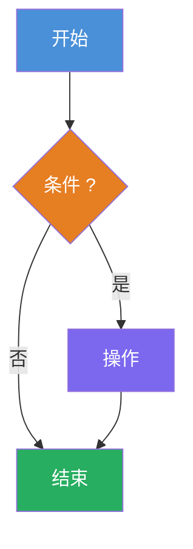

# 快速教程文档规范

本规范适用于：快速教程、章节教程、技术要点讲解类文档。

---

## 0. 核心原则（最高优先级）

**客观性、合理性、符合大众认识**

所有设计、内容、表述必须首要遵循：

- **客观性**：描述事实，不主观臆断
- **合理性**：逻辑通顺，符合技术原理
- **符合大众认识**：与业界共识、主流理解保持一致

**遇到以下情况必须停下来确认**：

- 有异议或歧义的表述
- 多种理解方式且含义不同
- 与常见认知存在差异
- 无法确定是否准确

禁止在不确定的情况下继续编写。

---

## 1. 标题格式

| 类型 | 格式 | 示例 |
|------|------|------|
| 主标题 | `# 主题教程` | `# C语言快速排序教程` |
| 章节标题 | `## 数字. 标题` | `## 1. 算法概述` |
| 子标题 | `### 数字.数字 标题` | `### 2.1 整体流程` |

**约束**：
- 禁止使用 H4 及以下标题
- 标题简洁直接，不加冗余修饰词（如"核心"、"完整"、"与原理"）
- 章节编号连续，不跳号

---

## 2. 文档结构

**必须包含**：
1. `[TOC]` 目录（位于主标题之后、第一章之前）
2. 第一章：概述/介绍
3. 最后一章：总结

**章节分隔**：章节间使用 `<br/>` 分隔

**推荐章节顺序**（按需选择）：
1. 概述：定义、核心特性、适用场景
2. 流程图解：整体流程、核心流程
3. 代码实现：完整可运行代码
4. 核心解析：关键函数/模块解析
5. 复杂度/性能分析
6. 优化方案/进阶用法
7. 避坑指南/常见错误
8. 总结：核心要点汇总

---

## 3. 内容风格

### 3.1 开头定义

第一章开头必须有一句话极简定义，用 **粗体** 强调核心概念。

**格式**：
```
[主题]是[一句话定义，用**粗体**强调核心概念]。
```

### 3.2 列表项格式

- 使用 `-` 开头（不是 `*` 或数字）
- 每个列表项单独一行
- 列表项之间空一行

**正确**：
```markdown
- **特性1**：说明

- **特性2**：说明
```

**错误**：
```markdown
- **特性1**：说明
- **特性2**：说明
```

### 3.3 代码块

- 代码块前有简要说明
- 代码块语言标识明确（如 `c`、`python`）
- 关键代码行加注释
- 代码后可加核心结论（用 **粗体**）

### 3.4 文字要求

- 一句话说清一个点
- 先结论后细节
- 避免冗余描述

---

## 4. Mermaid 图规范

### 4.1 节点描述

- 简洁明了，不写完整句子
- 使用 `?` 结尾的判断节点
- 示例：`left < right ?`（而非"判断区间是否有效 left < right"）

### 4.2 色块规范（必须遵守）

| 节点类型 | 颜色 | 色值 | 用途 |
|---------|------|------|------|
| 开始/入口 | 蓝色 | `#4A90D9` | 流程起点 |
| 判断/条件 | 橙色 | `#E67E22` | 分支判断 |
| 操作/处理 | 紫色 | `#7B68EE` | 执行操作 |
| 成功/完成 | 绿色 | `#27AE60` | 操作结果、流程结束 |
| 终止/结束 | 灰色 | `#95A5A6` | 递归终止、异常结束 |

### 4.3 格式示例



---

## 5. 参考示例

新文档编写前，**必须参考** `E:\gitee\Quama\docs\文档模板\examples` 下的相似文档：

| 主题 | 参考文件 |
|------|---------|
| C语言 | `教程示例-C语言指针.md`、`示例-指针章节教程.md` |
| 算法 | `教程示例-快速排序.md` |
| C#设计模式 | `教程示例-CSharp抽象工厂.md` |

**参考要点**：
- 文档整体结构
- 标题命名风格
- Mermaid 图绘制方式（色块使用）
- 代码块格式
- 内容详略程度
- 列表项格式