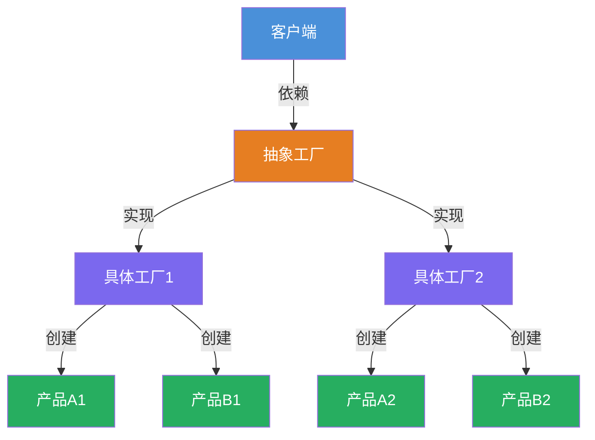
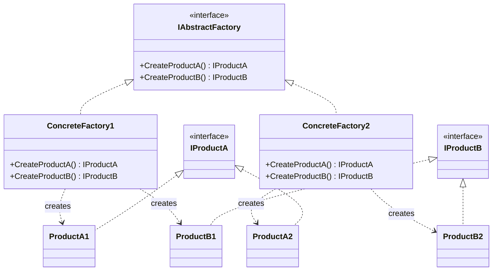

# 抽象工厂模式

[TOC]


## 一、📖 概述

抽象工厂模式是**创建型设计模式**，提供一个接口用于创建**相关或依赖对象的家族**，而无需指定具体类。

核心思想：将对象的创建与使用分离，客户端仅依赖抽象接口，不关心具体实现。当需要创建一系列相关对象时，抽象工厂确保它们属于同一产品族。

### 核心特性

- **封装性**：客户端不直接创建对象，通过工厂获取

- **一致性**：确保同一工厂创建的对象属于同一产品族

- **可扩展**：新增产品族只需新增工厂类，无需修改现有代码

- **符合开闭原则**：对扩展开放，对修改关闭

<br/>

## 二、📐 结构图解

### 2.1 整体结构



### 2.2 类关系



<br/>

## 三、💻 代码实现

以跨平台UI组件为例：Windows和Mac两套UI组件（按钮、文本框），通过抽象工厂确保同一平台的组件风格一致。

### 3.1 产品接口

```csharp
// 抽象产品A：按钮
public interface IButton
{
    void Render();
    void OnClick();
}

// 抽象产品B：文本框
public interface ITextBox
{
    void Render();
    string GetText();
}
```

### 3.2 具体产品

```csharp
// Windows产品族
public class WindowsButton : IButton
{
    public void Render() => Console.WriteLine("渲染Windows风格按钮");
    public void OnClick() => Console.WriteLine("Windows按钮点击事件");
}

public class WindowsTextBox : ITextBox
{
    public void Render() => Console.WriteLine("渲染Windows风格文本框");
    public string GetText() => "Windows文本内容";
}

// Mac产品族
public class MacButton : IButton
{
    public void Render() => Console.WriteLine("渲染Mac风格按钮");
    public void OnClick() => Console.WriteLine("Mac按钮点击事件");
}

public class MacTextBox : ITextBox
{
    public void Render() => Console.WriteLine("渲染Mac风格文本框");
    public string GetText() => "Mac文本内容";
}
```

### 3.3 抽象工厂与具体工厂

```csharp
// 抽象工厂
public interface IUIFactory
{
    IButton CreateButton();
    ITextBox CreateTextBox();
}

// Windows工厂
public class WindowsFactory : IUIFactory
{
    public IButton CreateButton() => new WindowsButton();
    public ITextBox CreateTextBox() => new WindowsTextBox();
}

// Mac工厂
public class MacFactory : IUIFactory
{
    public IButton CreateButton() => new MacButton();
    public ITextBox CreateTextBox() => new MacTextBox();
}
```

### 3.4 客户端使用

```csharp
public class Application
{
    private readonly IButton _button;
    private readonly ITextBox _textBox;

    // 依赖注入抽象工厂
    public Application(IUIFactory factory)
    {
        _button = factory.CreateButton();
        _textBox = factory.CreateTextBox();
    }

    public void Run()
    {
        _textBox.Render();
        _button.Render();
        _button.OnClick();
        Console.WriteLine(_textBox.GetText());
    }
}

// 使用示例
public class Program
{
    public static void Main()
    {
        // 切换平台只需修改这一行
        IUIFactory factory = new MacFactory();
        // IUIFactory factory = new WindowsFactory();

        var app = new Application(factory);
        app.Run();
    }
}
```

**运行结果**（Mac工厂）：
```
渲染Mac风格文本框
渲染Mac风格按钮
Mac按钮点击事件
Mac文本内容
```

<br/>

## 四、🔍 核心解析

### 4.1 工厂接口

`IUIFactory` 定义了创建产品的方法契约，客户端仅依赖此接口，不关心具体实现。新增产品类型只需修改工厂接口。

### 4.2 具体工厂

`WindowsFactory` 和 `MacFactory` 各自负责创建同一产品族的对象，确保同一平台的组件风格一致。

### 4.3 客户端解耦

`Application` 类通过构造函数接收抽象工厂，运行时动态决定使用哪套产品。切换平台无需修改 `Application` 代码。

<br/>

## 五、🎯 应用场景

### 5.1 适用场景

- 系统需要多套风格一致的UI组件

- 数据库访问层需要支持多种数据库

- 游戏中需要切换不同主题的道具

### 5.2 实际案例

- **.NET抽象工厂**：`IDbProviderFactory` 创建数据库连接、命令等对象

- **跨平台框架**：Maui、Avalonia通过工厂适配不同平台

- **游戏引擎**：Unity通过工厂创建不同平台的输入设备

<br/>

## 六、⚖️ 优缺点分析

### 6.1 优点

- **产品族一致性**：同一工厂创建的对象风格统一

- **符合开闭原则**：新增产品族无需修改现有代码

- **解耦客户端**：客户端不依赖具体类，只依赖抽象接口

### 6.2 缺点

- **扩展困难**：新增产品类型需修改所有工厂接口

- **类数量增多**：每新增一个产品族，需要增加对应的具体工厂和产品类

<br/>

## 七、📝 总结

- **核心思想**：创建一系列相关对象的家族，不指定具体类

- **关键角色**：抽象工厂、具体工厂、抽象产品、具体产品

- **适用场景**：需要多套风格一致的对象，且运行时动态切换

- **注意事项**：新增产品类型成本较高，设计时需预估扩展方向